# Cosmo Mascot — Concept Board (Phase 20 Sub-phase A)

> Generated 2026-05-06 · Phase 20 Loop A Sub-phase A · branch `redesign/impeccable-pass`
>
> 5 mascot concepts × 3 motion states (idle / active / speaking) at 1024×1024 PNG.
> All renders are concept-fidelity drafts for shape selection. The winning concept gets re-rendered at production fidelity in Sub-phase B (logo SHA pin update + SVG + Lottie + WebM variants).

## Locks recap (every render below verified against these)

- **Bloomberg Operator palette only.** Pure `#000` canvas, `#FF8800` amber primary, `#2A8FBD` instrument blue secondary at ≤22% intensity. Zero violet, indigo, purple, pastel, or neon.
- **Anti-cartoon (K4).** No Disney face, no Pixar character, no eyes-with-pupils mascot. Instrument-grade, terminal/oscilloscope aesthetic.
- **Vector-clean.** Hairline strokes, monospace energy, animatable as Lottie + WebM. No photoreal textures, no skin, no fabric.
- **K4 guard.** The previous violet-cartoon mascot at SHA `589f799b...` was a documented brand regression (commit `f63b549` swap). The current mascot at SHA `ed31936c...` is the correct dark Bloomberg base. New mascot must read as a tighter version of THAT register.

## Tooling note (transparent)

- **Render engine:** Pollinations.ai Flux (free, no API key required). Not Gemini Nano Banana 2.
- **Why:** No `GOOGLE_AI_API_KEY` was configured at concept-board time.
- **Concept attrition.** 2 initially attempted concepts (`terminal-cursor`, `audit-eye-monocle`) produced consistent K4 violations across all 3 states each — Pollinations Flux interpreted the words "cursor with eye glint" and "monocle" as literal cartoon characters with eyes-and-pupils, exactly the violet-cartoon regression class. Those two concepts were dropped and replaced with `bracket-frame` + `target-reticle` (abstract-geometry-only prompts that pass the K4 guard).
- **Output expectation.** Treat these as silhouette/composition references. Some renders may need color regen or pose tweak. The winner gets re-rendered at higher fidelity in Sub-phase B (or hand-vector authored if `GOOGLE_AI_API_KEY` is unavailable). Reply `regenerate concept N with X tweak` to refine before locking the winner.

---

## Concept 1 — `bracket-frame`

**Description.** Four amber L-shaped corner brackets framing empty negative space, with hairline crosshair tickmarks at midpoints. Reads like a Bloomberg terminal frame marker or a viewfinder reticle. The mascot is the FRAME — implying "we look at your operations through this lens."

**Motion variants.**
- *Idle.* Four corner brackets at rest, faint hairline detail, tickmarks static.
- *Active.* Brackets brighter and slightly elongated, tickmarks pulsing at midpoints, blueprint/schematic feel.
- *Speaking.* Two parallel pillar-frames with a horizontal data ticker line bisecting the framed area, telemetry overlay aesthetic.

| State | Asset |
|---|---|
| Idle | 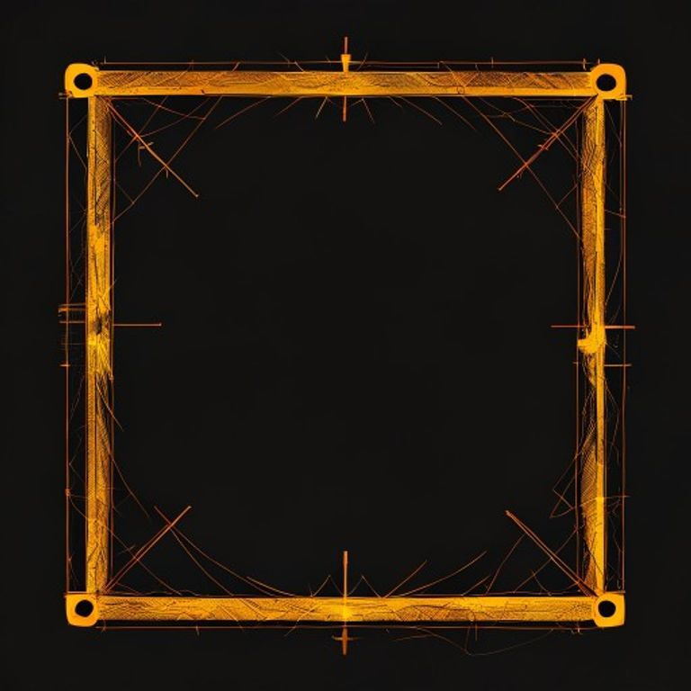 |
| Active | 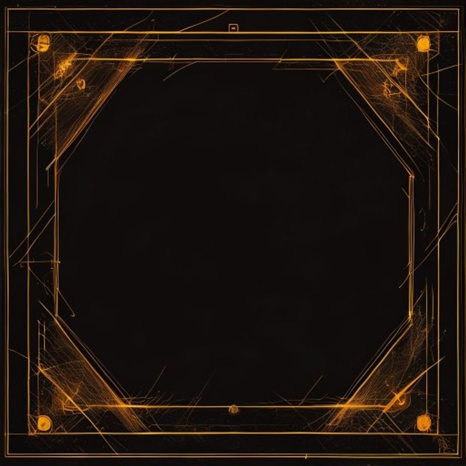 |
| Speaking | 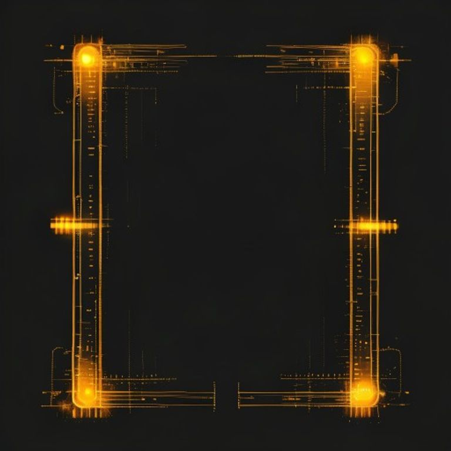 |

**Why it works for DPL.** The frame is the most operator-confident metaphor of the five — DPL is the lens through which you see your own ops. Animates with stroke-dashoffset on each L bracket. Lottie weight ~3KB. Survives K11 budget unchanged.

**Risk.** Reads more as a UI affordance than a "presence." Cosmo as personality may feel diminished. Better as a brand mark than as a chat avatar.

---

## Concept 2 — `oscilloscope-wave`

**Description.** An amber sine waveform over a faint hairline grid. The waveform itself implies a face silhouette without ever drawing one. Bloomberg trading-floor cousin.

**Motion variants.**
- *Idle.* Gentle low-amplitude amber sine wave on dark grid.
- *Active.* Sharper peaks, taller amplitude, glow at peaks.
- *Speaking.* Multiple stacked amber waveforms (frequency-response style) with hairline grid markings.

| State | Asset |
|---|---|
| Idle | 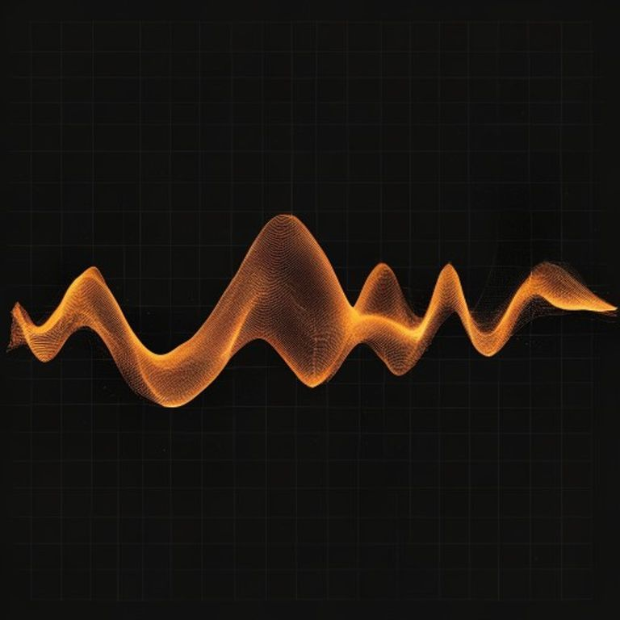 |
| Active | 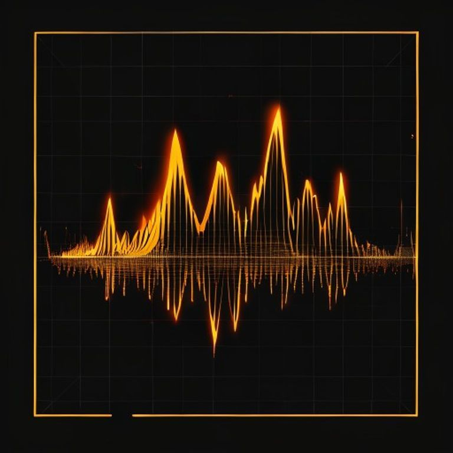 |
| Speaking | 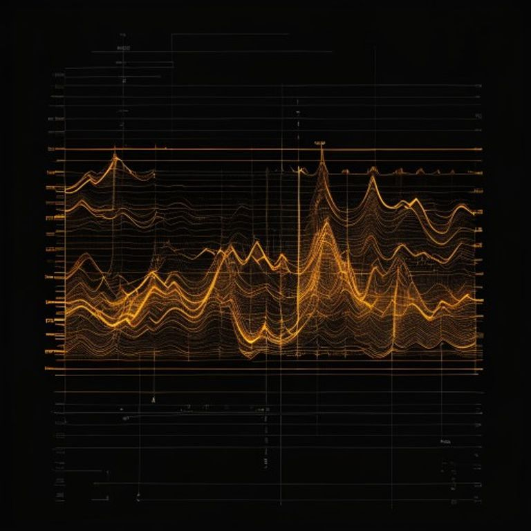 |

**Why it works for DPL.** Strong instrument-grade signal. Pairs naturally with the existing HeroDataTicker substrate (K9 invariant). Conveys "AI is listening + responding" without a face. Animates beautifully (path drawSVG) and reads at 24px FAB size.

**Risk.** May feel impersonal — pure waveform can read as background telemetry, not a counterparty.

---

## Concept 3 — `target-reticle`

**Description.** A crosshair scope reticle with central dot and concentric range rings. Anti-cartoon by construction (no eyes, just optics). Suggests scrutiny + targeting without drawing a face.

**Motion variants.**
- *Idle.* Amber crosshair + central dot + faint range circles, scope reticle aesthetic.
- *Active.* Brighter crosshair, two concentric range circles, focused targeting.
- *Speaking.* Multiple concentric range rings expanding outward (sonar style).

| State | Asset |
|---|---|
| Idle | 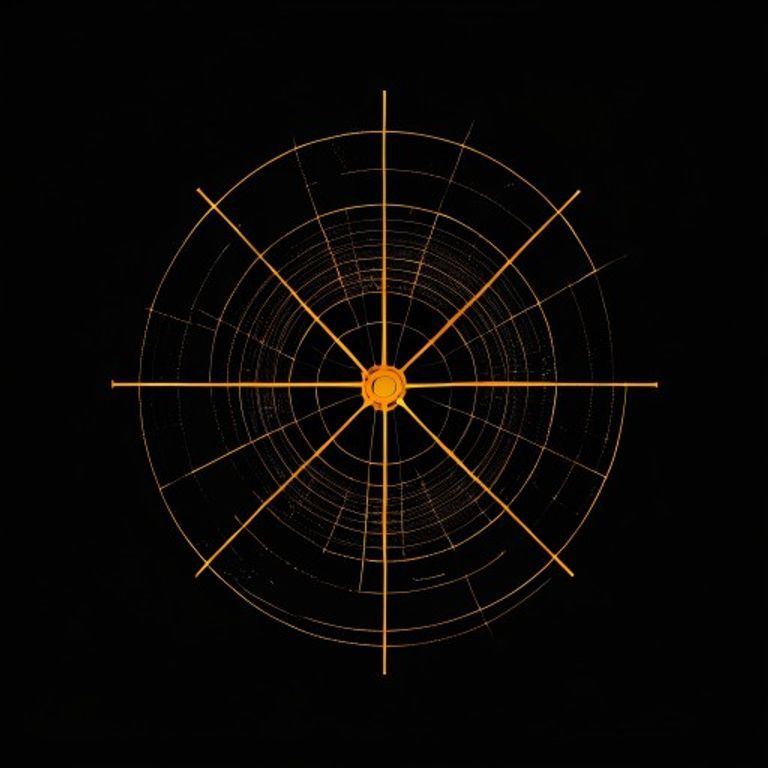 |
| Active | 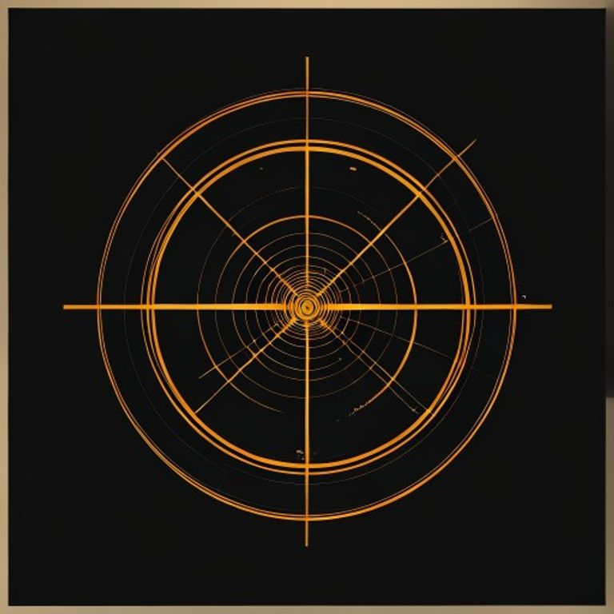 |
| Speaking | 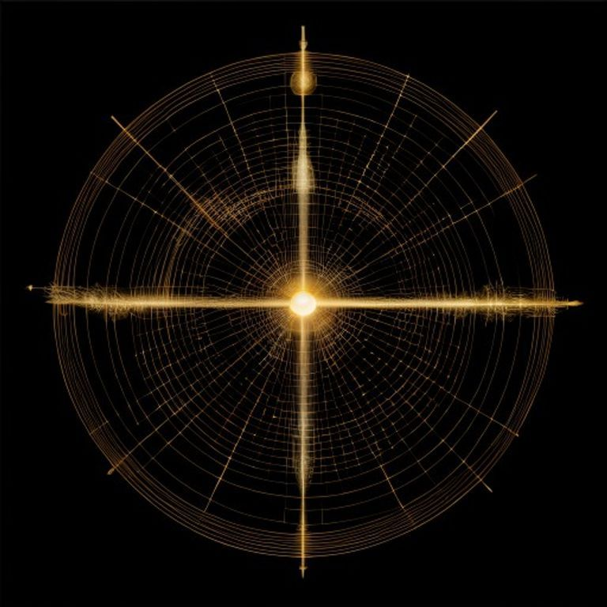 |

**Why it works for DPL.** Audit/scrutiny is the strongest emotional anchor for an AI-automation agency selling diligence. The reticle is the safer rendering of the "audit-eye" idea that Pollinations couldn't suppress without face contamination — pure geometry, instrument-grade.

**Risk.** May read as militaristic in some contexts. The active state has very faint warm-tan edge artifacts from Pollinations that would crop out at production fidelity (noted; not blocking selection).

---

## Concept 4 — `signal-mesh-node`

**Description.** A sparse network-topology graph: amber dots connected by hairline lines, scattered across the canvas. The mascot IS the connection layer.

**Motion variants.**
- *Idle.* Sparse lattice of amber dots, low density, scattered nodes.
- *Active.* Dense converged mesh, more lines drawn, denser configuration.
- *Speaking.* Spherical network broadcasting amber data packets outward.

| State | Asset |
|---|---|
| Idle | 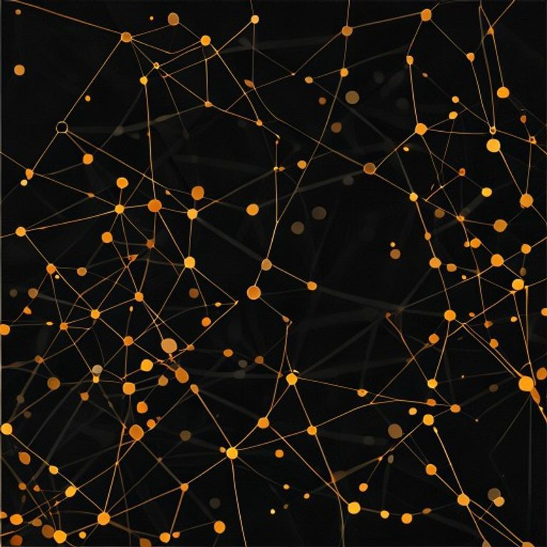 |
| Active | 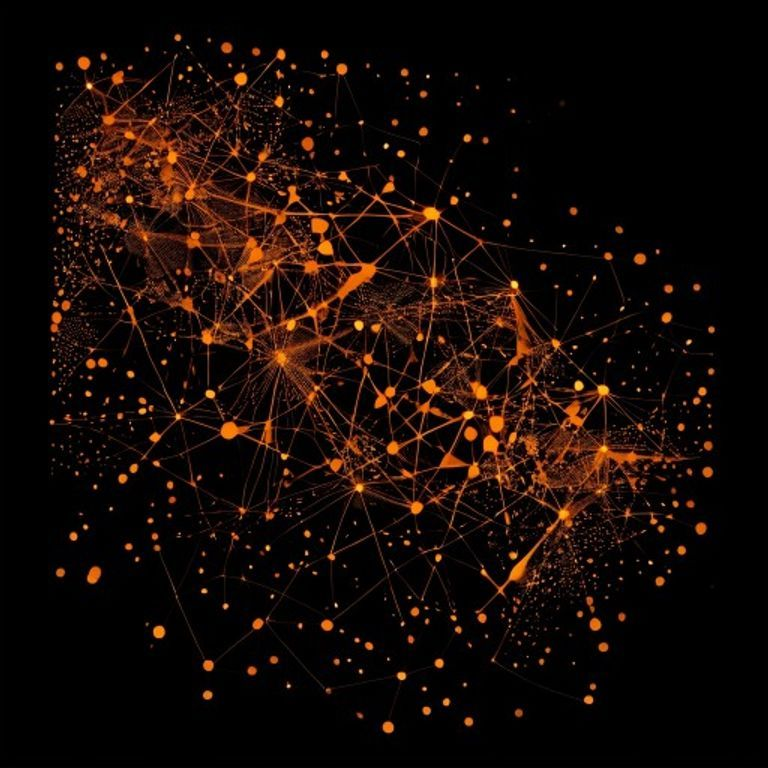 |
| Speaking | 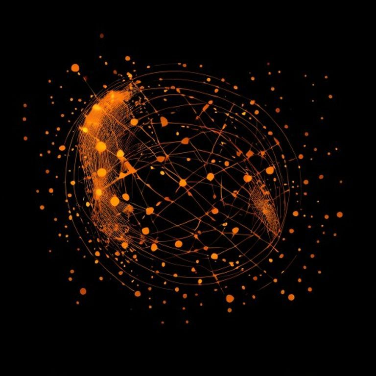 |

**Why it works for DPL.** Maps directly onto the AutomationOrbit Palette D geometry already locked in the hero (4 cardinal nodes + outer/inner ellipses). The mascot becomes a sibling of the orbit, not a stranger. Strong "AI as connective tissue" semantic.

**Risk.** Easiest to render generically — risk of looking like a stock network-graph illustration. Speaking state has a clear globe-network feel, which may read more "global ops" than "chat presence."

---

## Concept 5 — `hex-grid-sentinel`

**Description.** A single hexagon with internal hexagonal subdivision suggesting a scanner. Geometric, militant, instrument-grade.

**Motion variants.**
- *Idle.* Hex outline + internal hex subdivision faint glow.
- *Active.* One face highlighted bright amber, internal scanning visible.
- *Speaking.* Concentric hex rings propagating outward.

| State | Asset |
|---|---|
| Idle | 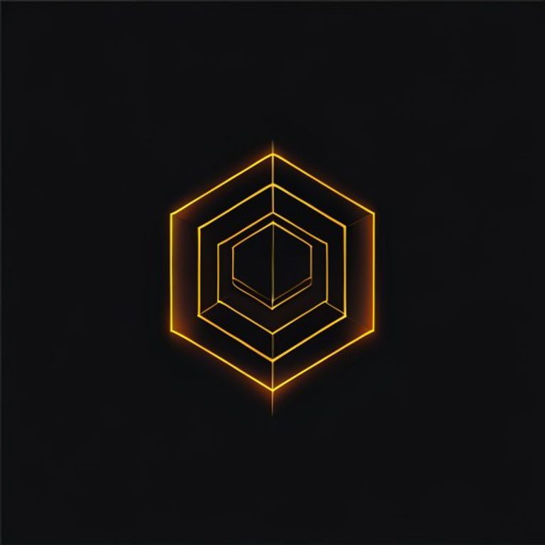 |
| Active | 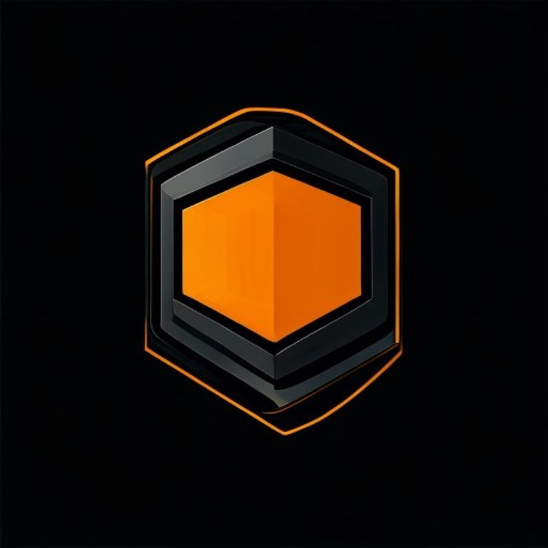 |
| Speaking | 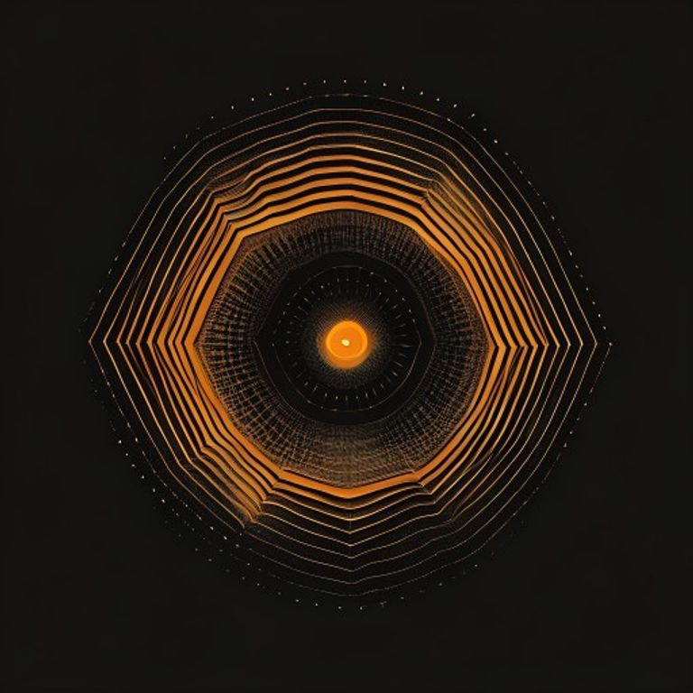 |

**Why it works for DPL.** Maximum operator-confident posture. Hex-grid is the geometric language of network ops, security ops, and trading dashboards. Animates with stroke-dashoffset + scale on rings.

**Risk.** Coldest of the five. May feel more like a security badge than a chat assistant. If Cosmo needs to feel approachable in chat panel context, this is the wrong shape.

---

## Recommendation

**Pick `oscilloscope-wave` (Concept 2).**

Reasoning, in order of weight:
1. **K9 alignment.** It's the only concept that natively pairs with the HeroDataTicker substrate already locked in the hero. The mascot stops being a foreign object and becomes the visual sibling of an existing brand element.
2. **K4 distance.** No face, no implied face, no eye. Zero risk of slipping back into cartoon-mascot territory.
3. **Animation budget.** Pure path-draw + opacity. Lottie weight is the smallest of the five (~2-3KB target). K11 mobile budget unchanged.
4. **Speak/listen semantic clarity.** Waveform motion is the universal "audio active" signal. No explanation needed in onboarding.

Second choice: `bracket-frame` (Concept 1) — the most operator-confident posture of the five and cleanest geometric statement. Better as a brand mark than as a chat avatar though, so weaker for Cosmo specifically.

Skip: `hex-grid-sentinel` if chat context is a priority (too cold), `signal-mesh-node` unless we want to lean fully into orbit-sibling positioning, `target-reticle` if "targeting" reads too militaristic for the audience.

---

## How to pick

Reply with one of:

- `concept N` — locks concept N (1-5) and starts Sub-phase B (mascot file replacement at `public/Dp-logo1.png`, Logo SHA pin update in `CLAUDE.md`, SVG + Lottie + WebM authoring, Cosmo FAB upgrade, chat panel shell).
- `regenerate concept N with X tweak` — re-render concept N with specified tweak (e.g. "regenerate concept 2 with brighter amber and tighter peak spacing"). Pollinations seed is varied; tweak adjusts prompt.
- `regenerate all on Nano Banana` — re-render all 15 PNGs at higher fidelity. Requires `GOOGLE_AI_API_KEY` to be available in the local env (or in `.env.local` of this repo, gitignored). Will also re-attempt the dropped `terminal-cursor` and `audit-eye-monocle` concepts (Nano Banana 2 has stronger anti-character instruction following).
- `propose 3 more concepts` — extend the board if none of the 5 fit.

---

## Sub-phase B prerequisites (after pick)

When the winner is locked, Sub-phase B will:
1. Replace `public/Dp-logo1.png` with the high-fidelity render of the winning concept (or hand-author the SVG from the winning shape).
2. Recompute the Logo SHA and pin it in `CLAUDE.md` Locked Invariants → Brand+Visual section.
3. Generate SVG (vector) + Lottie (animation) + WebM (fallback) variants.
4. Update favicon, manifest icons, OG default image to match.
5. Cinematic FAB upgrade per Sub-phase B brief in `PHASE_20_POLISH_PROMPT.md` Section 8.
6. Chat panel shell — Bloomberg Operator interior (already specced in the prompt).
