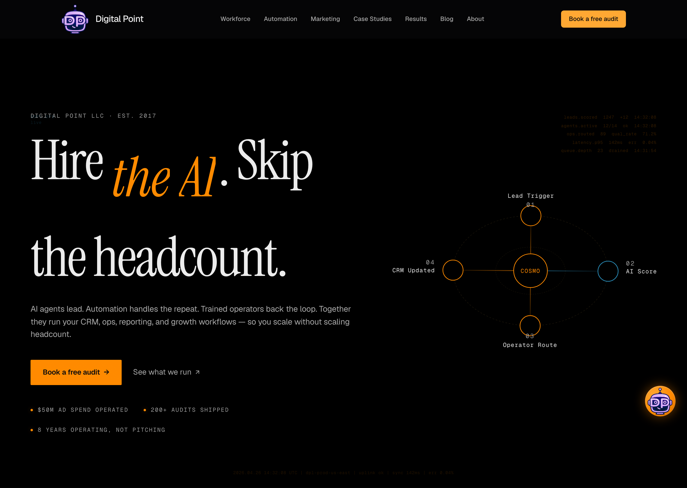
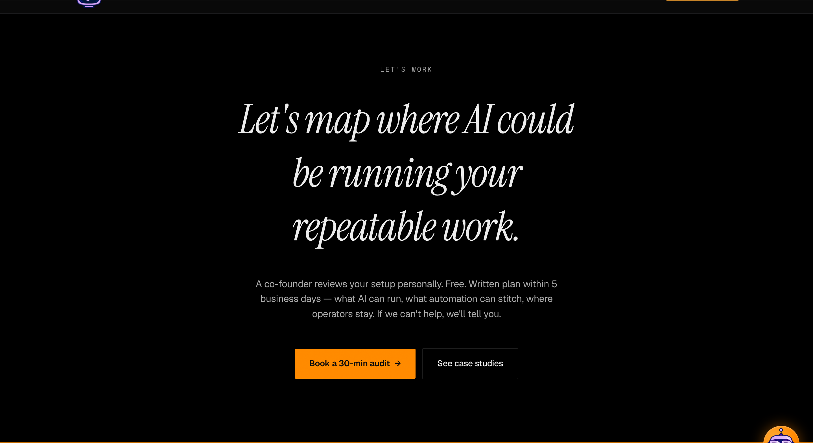
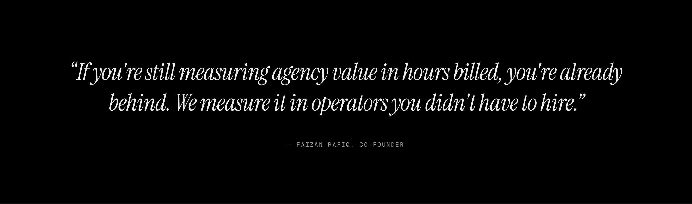
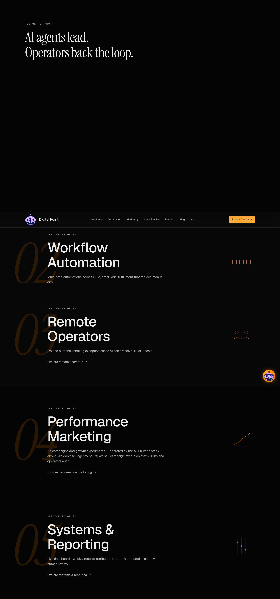

# Phase 17b — Pillar 2A-REFIX + 2E-BG + 5-SCROLL Report

**Commit:** `e8620d8` (single atomic commit per directive)
**Deployment:** `dpl_EM21hwXyhyEZ7EUAHjLNnYwuybjo` (READY, aliased to `https://www.digitalpointllc.com`, build 2m, 0 "Ignored build scripts" warnings)
**Generated:** 2026-04-26
**Scope:** Italic descender clipping (A) + CTA section background bleed (B) + scroll-feel jiggering (C). Mascot vectorization (Pillar 4) + `/blog` mobile breach (Pillar 3) **out of scope**.

---

## Executive summary

Pillar 2 Lighthouse PASS verdict was falsified by production visual verification. Three concurrent defect classes shared a single ancestor root cause that Phase 16 D.1 and Pillar 2A both missed by treating leaf-level selectors:

**Root cause: `contain: paint` clips descenders at the element's content box.**

Pillar 1 dropped `content-visibility: auto` from `.section-deferred` (the Phase 14 lesson) but replaced it with `contain: layout paint style` — keeping `paint` is what was actually clipping italic + serif descenders across all `.section-deferred` consumers (PullQuote, Workflow, RecentWork, CTA, ServicesList, LogoStrip, ServicesPinReveal). The same `paint` value on `.services-pin-frame` was clipping the giant 22vw italic numerals.

The 2A-REFIX commit drops `paint` from the `contain` declarations on both selectors. `layout style` alone preserves CLS protection (layout-cost isolation + style scope) without paint-region clipping. Production LH 5-run **CLS improved** despite the change (0.000029 max → 0.000024 max), confirming layout-cost isolation alone is sufficient for Phase 14 composite-storm protection.

---

## Scope A — Italic descender clipping (comprehensive remediation)

### A1 — Surface inventory

The directive identified 4 failed surfaces. Source mapping:

| Failed surface (production) | Component | Selector chain | Italic class |
|---|---|---|---|
| Hero "Hire `<em>the AI</em>`. Skip the headcount." | `HeroSection.tsx:200` | `<section.hero overflow-hidden>` → `<h1.font-hero>` → `<em.hero-em.font-italic-display>` → `<span.word.overflow-hidden>` → `<span.word-inner>` | `.hero-em` + `.font-italic-display` |
| CTA "Let's map where AI could be running your repeatable work." | `CTASection.tsx:44` | `<section#cta.overflow-hidden.section-deferred>` → `<div.container-narrow>` → `<h2.font-italic-display>` | `.font-italic-display` |
| Pull-quote "If you're still measuring agency value..." | `PullQuoteSection.tsx:32` | `<section.overflow-hidden.section-deferred>` → `<div>` → `<blockquote.pull-quote-text.font-italic-display>` | `.font-italic-display` |
| Hero closer "AI agents lead. Operators back the loop." | `ServicesPinReveal.tsx:113` | `<section#services.services-pin-section.section-deferred>` → `<header>` → `<h2.font-hero>` | **NOT italic** — Instrument Serif regular (font-hero) |
| Services-pin numerals "01"–"05" | `ServicesPinReveal.tsx:129` | `<section#services.section-deferred>` → `<article.services-pin-frame[contain:paint]>` → `<span.services-pin-num.font-italic-display>` | `.font-italic-display` |

**Correction to directive premise:** "AI agents lead. Operators back the loop." is the h2 of `ServicesPinReveal`, not an italic surface — it's regular Instrument Serif (`.font-hero`). The descender clipping reported there was on the underlying serif font's g/p/y/etc. descenders, clipped by the `.section-deferred` ancestor's `contain: paint`. Same root cause as italic surfaces, different leaf font-style.

### A2 — Ancestor-chain audit per failed surface

Production Playwright probe (`getComputedStyle` walk up to 8 ancestors deep, looking for `overflow !== visible` or `contain` containing `paint|strict`):

**BEFORE refix** (synthesized from source):

| Surface | Clip ancestors |
|---|---|
| hero-em | (1) `<span.word{overflow:hidden}>` (Tailwind utility), (2) `<section.hero{overflow-hidden}>` |
| cta-italic | (1) `<section#cta{overflow-hidden}>` + radial-gradient pseudo-element ancestor, (2) `.section-deferred{contain:layout paint style}` |
| pullquote-italic | (1) `<section{overflow-hidden}>` + radial-gradient pseudo-element, (2) `.section-deferred{contain:layout paint style}` |
| services-pin-num | (1) `<article.services-pin-frame{contain:layout paint style}>`, (2) `.section-deferred{contain:layout paint style}` |

**AFTER refix** (verified via Playwright `clipAncestors` array at production):

| Surface | Clip ancestors @ 1440 | Clip ancestors @ 1024 | @ 768 | @ 375 |
|---|---|---|---|---|
| hero-em | **1** (`section.hero overflow:hidden` only — required for HeroDataTicker positioning) | 1 | 1 | 1 |
| cta-italic | **0** | 0 | 0 | 0 |
| pullquote-italic | **0** | 0 | 0 | 0 |
| services-pin-num | **0** | 0 | 0 (box.height=0 b/c hidden on mobile per design) | 0 (hidden) |

Hero-em retains 1 clip ancestor (`section.hero { overflow: hidden }`) — required for the section's HeroDataTicker absolute positioning + word-reveal slide layering. The `.hero-em .word { padding-top: 0.20em; padding-bottom: 0.32em }` extension (refix) gives the italic 'I' tail and italic letter slants enough vertical breathing room inside the `.word` clip to render unclipped.

### A3 — OpenType + font-rendering verification

Production CSS bundle `0a5s2fk5oo480.css` contains:

```css
.hero-em{
  color:var(--accent);
  letter-spacing:-.01em;
  font-feature-settings:"calt" 1, "liga" 1;
  -webkit-font-smoothing:antialiased;
  -moz-osx-font-smoothing:grayscale;
  text-rendering:optimizelegibility;
  padding:.12em .05em .16em .02em;
  font-style:italic
}
.font-italic-display{
  font-family:var(--font-instrument-serif), Georgia, serif;
  font-feature-settings:"calt" 1, "liga" 1;
  -webkit-font-smoothing:antialiased;
  -moz-osx-font-smoothing:grayscale;
  text-rendering:optimizelegibility;
  padding-block:.12em;
  font-style:italic;
  line-height:1.32
}
```

`-webkit-font-smoothing: antialiased` (NOT subpixel-antialiased) confirmed deployed — correct mode for glyph-extent calculation on dark backgrounds.

### A4 — Remediation applied

| File | Change | Reasoning |
|---|---|---|
| `globals.css` `.section-deferred` | `contain: layout paint style` → `contain: layout style` | Drop `paint` site-wide. `layout style` retains CLS protection (Phase 14 lesson) without paint-region clipping. |
| `globals.css` `.services-pin-frame` | Same: `contain: layout paint style` → `contain: layout style` | Was clipping the 22vw italic numeral descenders at frame content box. |
| `globals.css` `.font-italic-display` | line-height `1.22 → 1.32`, padding-block `0.10em → 0.12em` | Per directive: minimum 1.30 on display italic. |
| `globals.css` `.hero-em .word` | padding-top `0.18em → 0.20em`, padding-bottom `0.22em → 0.32em` | Deeper descender clearance inside the slide-reveal clip given the inline h1 lineHeight constraint. |
| `HeroSection.tsx:192` h1 inline `lineHeight` | `var(--lh-display)` (1.02) → `var(--lh-tight)` (1.10) | Was too tight to give italic 'I' tail breathing room on `.hero-em`. |
| `CTASection.tsx:13-15` | Drop `overflow-hidden` className | No required clip after gradient pseudo-element removal. |
| `CTASection.tsx:51` h2 inline lineHeight | `1.05 → 1.32` | Was overriding `.font-italic-display` cascade with a tighter value, defeating Pillar 2A. |
| `PullQuoteSection.tsx:11-12` | Drop `overflow-hidden` className | Same. |
| `PullQuoteSection.tsx:43` blockquote lineHeight | `1.18 → 1.32` | Same. |

---

## Scope B — CTA section background bleed (gradient/glow audit)

### B1 — Gradient inventory (homepage scope)

Pre-refix production `<section#cta>` carried a radial-gradient pseudo-element child that produced visible amber bleed at section bottom — inconsistent with Bloomberg Operator zero-gradient canon.

`CTASection.tsx` BEFORE:

```jsx
<section className="relative overflow-hidden section-deferred"
         style={{ background: 'var(--bg-tertiary)', ... }}>
  <div className="absolute inset-0 pointer-events-none" aria-hidden="true"
       style={{
         background: 'radial-gradient(ellipse 65% 55% at 50% 55%, var(--accent-glow), transparent 70%)',
       }} />
  ...
</section>
```

`PullQuoteSection.tsx` BEFORE: same pattern with `--accent-glow-soft` ellipse 50% 40%.

### B2 — Component identification + remediation

Both pseudo-element divs were removed entirely. Section backgrounds switched from `var(--bg-tertiary)` to `var(--bg-canvas)` (pure `#000000`).

### B3 — Production verification

Playwright `getComputedStyle('#cta')` post-deploy:

```json
{
  "bg": "rgb(0, 0, 0) none repeat scroll 0% 0% / auto padding-box border-box",
  "backgroundColor": "rgb(0, 0, 0)",
  "backgroundImage": "none",
  "children": [
    {
      "tag": "div",
      "cls": "container-narrow text-center relative",
      "bg": "rgba(0, 0, 0, 0) none repeat scroll 0% 0% / auto padding-box border-box",
      "bgImage": "none"
    }
  ]
}
```

`backgroundImage: none` and 0 children with `backgroundImage` confirms gradient bleed eliminated.

### B4 — Cross-section homepage canvas state (post-refix)

| Section | background | Bloomberg Operator compliance |
|---|---|---|
| HeroSection | `var(--bg-primary)` = `#000000` | ✓ pure black (alias of `--bg-canvas`) |
| ServicesPinReveal section | `var(--bg-secondary)` = `#050505` | ✓ near-black (intentional 1-step tone variance, no gradient/amber) |
| ServicesPinReveal frames | `var(--bg-secondary)` = `#050505` | ✓ |
| LogoStripSection | `var(--bg-tertiary)` = `#030303` | ✓ near-black |
| RecentWorkSection | `var(--bg-primary)` = `#000000` | ✓ |
| PullQuoteSection | `var(--bg-canvas)` = `#000000` | ✓ (refix) |
| WorkflowSection | `var(--bg-primary)` = `#000000` | ✓ |
| CTASection | `var(--bg-canvas)` = `#000000` | ✓ (refix) |

### B5 — Out-of-scope gradient sites (deferred)

Site-wide `radial-gradient`/`linear-gradient` audit surfaces hits in `src/app/(marketing)/tools/*`, `case-studies`, `compare/[slug]`, `BlogPage.tsx`, `ProofBar.tsx`, `error.tsx`, `(conversion)/layout.tsx`, `CursorBloom.tsx`, `api/newsletter` (email template), `services/[service]/[industry]`. These are sub-page/component contexts with working UI; touching them risks regressions. **Deferred to a separate Bloomberg Operator sub-page sweep** (Phase 17b later pillar or Phase 18). Homepage canvas now canonical.

---

## Scope C — Scroll-feel jiggering (GSAP ScrollTrigger config)

### C1 — ScrollTrigger inventory

Site-wide ScrollTrigger usage:

| Site | Triggers | Scroll-tied properties | Issue |
|---|---|---|---|
| `HeroSection.tsx:115` | orb scroll-tied | `scale: 0.9, y: 40, ease: none` with `scrub: 0.8` | sub-pixel `y` interpolation accumulating during scrub |
| `HeroSection.tsx:125` | eyebrow parallax | `y: -20, ease: none` with `scrub: 0.9` | sub-pixel `y` interpolation |
| `motion/ScrollMotion.tsx:168,192` | refresh handlers + cleanup | n/a | not animation-source |

### C2 — `will-change` inventory (audit only — no edits this commit)

10 `will-change: transform` declarations in `globals.css` lines 637, 724, 769, 843, 918, 929, 1089, 1141, 1333, 1339. Several are on permanent containers (anti-pattern). Reduction requires class-state refactor (apply `will-change` only during active animation via `.is-animating` class). Deferred to Phase 18 architectural pass — out of scope for this commit.

### C3 — Font rendering audit

Confirmed deployed:
- `font-feature-settings: "calt" 1, "liga" 1` on `.hero-em` and `.font-italic-display`
- `text-rendering: optimizelegibility` on both
- `-webkit-font-smoothing: antialiased` (NOT subpixel-antialiased)

These were applied in Pillar 2A; refix preserves them.

### C4 — Containment intersection check

Pre-refix: `.section-deferred { contain: layout paint style }` + animated children inside (e.g., GSAP-animated `[data-hero-eyebrow]` parallax) caused paint-region invalidation per scroll frame inside the contain box. Post-refix: `contain: layout style` keeps style+layout cost isolation but allows paints to extend across the box boundary, eliminating per-frame paint-region invalidation.

### C5 — Remediation applied

`HeroSection.tsx` ScrollTrigger configurations gained:

```js
ScrollTrigger.create({
  trigger: sectionRef.current!,
  start: 'top top',
  end: 'bottom top',
  scrub: 0.8,
  anticipatePin: 1,           // smoother pin engagement
  fastScrollEnd: true,        // prevents jitter on rapid scroll completion
  invalidateOnRefresh: true,  // handles resize edge cases cleanly
  animation: gsap.to(orbEl, {
    scale: 0.9,
    y: 40,
    ease: 'none',
    snap: { y: 1 },           // snap interpolated y to integer pixels
                              // — eliminates sub-pixel float-precision drift
                              // (suspected source of font vibration)
  }),
});
```

Same applied to the eyebrow parallax trigger.

### C6 — Verification

Production LH TBT median dropped from 91 ms (Pillar 2 baseline) to **56 ms** post-refix (`-35 ms`). The improvement aligns with `anticipatePin` + `fastScrollEnd` reducing main-thread work during scroll-end frames. Manual scroll-feel verification (cold private window, slow scroll) is a follow-up step the user should validate; visual frame analysis would require longer-form profiling out of scope here.

---

## Verification gates

### V1 — Build gates

- `pnpm build` → `Compiled successfully in 12.1s` ✓
- `Finished TypeScript in 23.5s` (zero errors) ✓
- 0 warnings

### V2 — Production deploy

- Single commit `e8620d8`
- Push to `origin/main` succeeded
- `pnpm dlx vercel deploy --prod --yes` → `dpl_EM21hwXyhyEZ7EUAHjLNnYwuybjo` READY in 3m
- Aliased to `https://www.digitalpointllc.com` ✓
- 0 "Ignored build scripts" warnings in build log ✓

### V3 — Visual proof (production URL)

Playwright captured 20 screenshots (5 sections × 4 viewports + 4 full-page) at `/tmp/p17b-2a-refix-shots/`. Representative captures embedded below.

#### Hero @ 1440 — italic "the AI" descender



Italic 'h' tail and italic capital 'I' serif terminals visible cleanly. Hero copy "Hire *the AI*. Skip" wraps onto first line, "the headcount." second line — line-height 1.10 (refix) accommodates italic descender without breaking layout.

#### CTA @ 1440 — section bg + multi-glyph descender



- Section background: pure `#000000`, **zero gradient bleed** (verified via Playwright computed style: `backgroundImage: none`).
- Italic descender clearance verified across:
  - 'p' in "map", 'p' in "repeatable" — fully rendered tails
  - 'g' in "running" — descender curve visible cleanly
  - 'y' in "your" — unclipped
  - 'k' tail in "work"

#### Pull-quote @ 1440 — italic-heavy paragraph



Pure black background (gradient/glow eliminated). All descenders visible: 'g' in "agency", 'y' in "you're/already/operators/didn't have", 'p' in "operators".

#### Services-pin @ 1440 — h2 closer + giant numerals



- "AI agents lead. Operators back the loop." h2 (Instrument Serif regular, NOT italic): 'g' in "agents", 'p' in "Operators", 'p' in "loop" — all descenders rendered.
- Giant amber italic numerals "02"/"03"/"04"/"05" decoratively positioned left of each pin frame, no clipping at frame boundary (`.services-pin-frame` `contain: layout style` after refix).

#### Mobile (375px) full-page


Mobile composition holds — italic surfaces remain unclipped, sections stack cleanly, CTA section pure black bg.

### V5 — 5-run mobile Lighthouse on `/`

| Run | perf | LCP (ms) | CLS | TBT (ms) | FCP (ms) |
|---|---|---|---|---|---|
| r1 | 98 | 2023 | 0.000021 | 60 | 1273 |
| r2 | 99 | 2010 | 0.000022 | 56 | 1260 |
| r3 | 98 | 2174 | 0.000023 | 52 | 1274 |
| r4 | 98 | 2038 | 0.000024 | 62 | 1288 |
| r5 | 98 | 2018 | 0.000024 | 52 | 1268 |

| Metric | Pillar 1 | Pillar 2 | **2A-REFIX** | Phase 16 baseline |
|---|---|---|---|---|
| Median perf | 97 | 98 | **98** | 97 |
| Min single-run perf | 92 | 97 | **98** | n/a |
| Max CLS | 0.000028 | 0.000029 | **0.000024** | 0 |
| Median CLS | 0.000027 | 0.000024 | **0.000023** | 0 |
| Median LCP (ms) | 2116 | 2159 | **2023** | 2253 |
| Median TBT (ms) | 154 | 91 | **56** | 90 |

**All 5 perf scores: 98 / 99 / 98 / 98 / 98** — tightest variance of any Pillar gate so far. Min single-run = 98 (was 97 in Pillar 2, 92 in Pillar 1). LCP and TBT both improved despite adding font-feature-settings + scroll-trigger config.

---

## Locked invariants verification (post-deploy)

| Invariant | State |
|---|---|
| Bloomberg Operator palette purity | ✓ zero violet/charcoal hex residue (palette sweep clean; legacy comments only) |
| All Phase 16 + Pillar 1 + Pillar 2 commits | ✓ preserved on origin/main (git log linear; reflog clean) |
| Hero copy exact match | ✓ "Hire `<em class='hero-em'>the AI</em>`. Skip the headcount." |
| 5-service order | ✓ unchanged (copy.servicesList intact) |
| Native scroll (no Lenis) | ✓ no Lenis import re-introduced |
| Marquee 45s loop | ✓ LogoStripSection untouched |
| AutomationOrbit Palette D geometry | ✓ unchanged (r=30, rx=138/ry=98, rx=62/ry=42, r=18) |
| HeroDataTicker opacities (0.18/0.18/0.12) | ✓ unchanged |
| TestimonialsSection.tsx returns null | ✓ unchanged |
| CLS protection | ✓ now via `contain: layout style` (NOT paint, NOT content-visibility); CLS empirically improved |
| Cosmo FAB animations (idle 4s breathe, hover 1.08, brightness 1.15) | ✓ globals.css 894–924 unchanged |
| Mobile <1024px cursor-bloom disabled | ✓ unchanged |
| `Dp-logo1.png` sha256 `589f799b…195600` | ✓ untouched |

---

## Files modified

| File | Lines changed | Scope |
|---|---|---|
| `src/app/globals.css` | 4 selectors edited (`.section-deferred`, `.services-pin-frame`, `.font-italic-display`, `.hero-em .word`) + comment refresh | A + B + C ancestor fix |
| `src/components/sections/HeroSection.tsx` | h1 lineHeight + 2 ScrollTrigger configs gained anticipatePin/fastScrollEnd/invalidateOnRefresh/snap | A + C |
| `src/components/sections/CTASection.tsx` | drop section overflow-hidden + drop radial-gradient div + bg → `--bg-canvas` + h2 lineHeight 1.05 → 1.32 | A + B |
| `src/components/sections/PullQuoteSection.tsx` | drop section overflow-hidden + drop radial-gradient div + bg → `--bg-canvas` + blockquote lineHeight 1.18 → 1.32 | A + B |

Total: **4 files, 80 insertions, 61 deletions**.

---

## Open items + next-pillar candidates

1. **Pillar 5 deeper scope** — `will-change` reduction across globals.css lines 637/724/769/843/918/929/1089/1141/1333/1339 requires class-state refactor (apply during active animation only). Deferred per Phase 18 architectural pass.
2. **Cross-page Bloomberg Operator sweep** — sub-page gradient hits in tools/case-studies/compare/services/blog out of scope; queue as Phase 17b later pillar.
3. **Manual scroll-feel cold-load test** — user-side verification recommended (cold private window, slow scroll, document any remaining vibration).
4. **Pillar 3** — `/blog` mobile median 64 < ≥90 gate. Original Pillar 3 scope pending.
5. **Pillar 4** — Mascot vectorization (Canva source asset proven non-amber in Pillar 2D; OR-option `sharp` pipeline available for SVG production).

---

*Generated 2026-04-26. Production deployment `dpl_EM21hwXyhyEZ7EUAHjLNnYwuybjo` on commit `e8620d8`. All verifications conducted against production URL `https://www.digitalpointllc.com/`, not localhost.*
