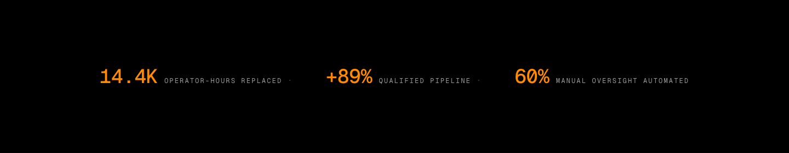
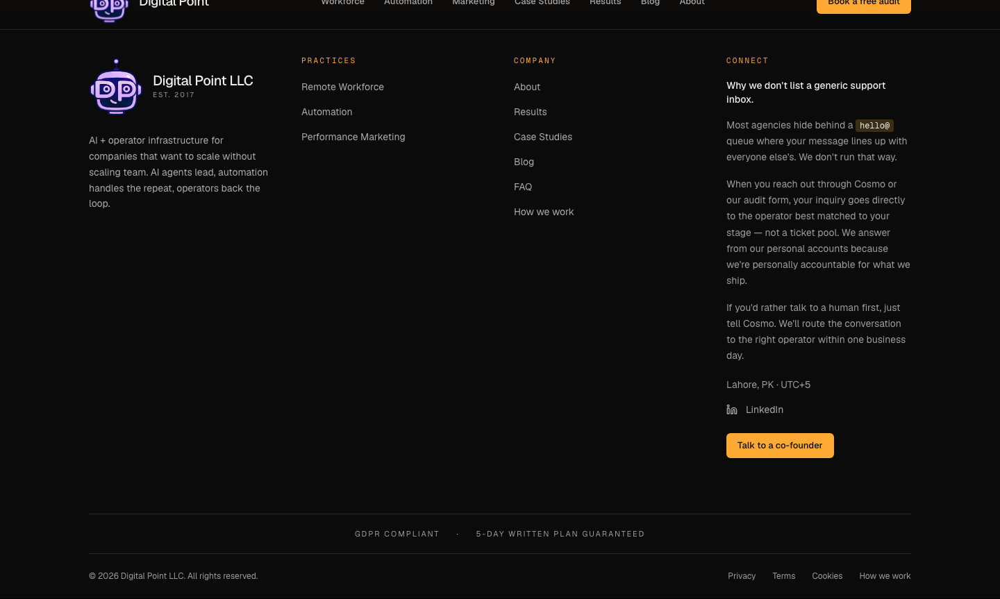
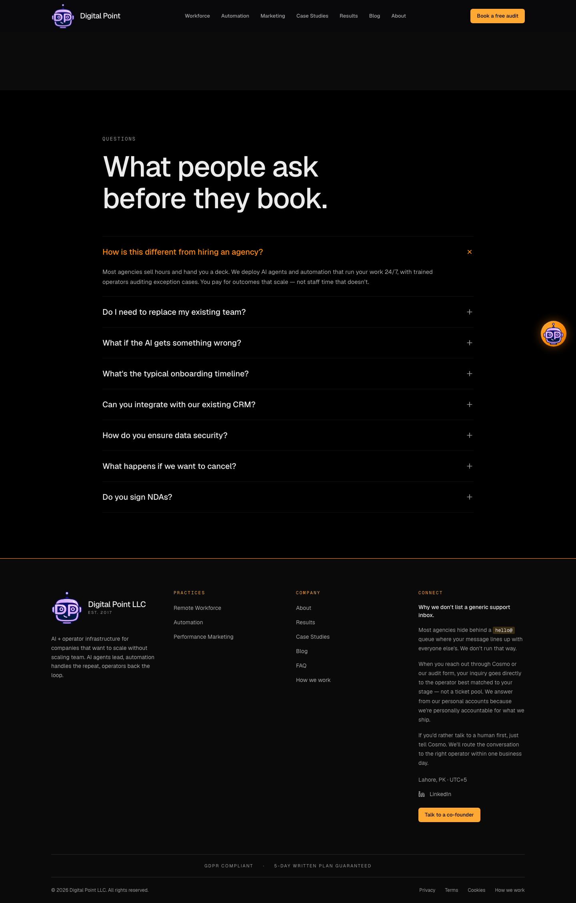
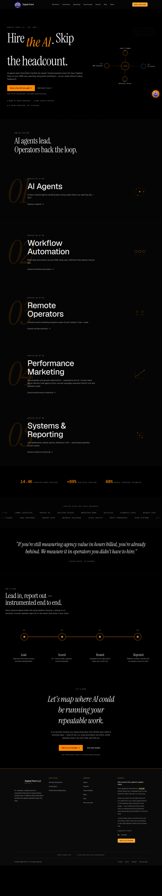

# Phase 17b — Pillar 3 Reversal Report

**Commit:** `c8b34c4` — `fix(homepage): reverse Pillar 3 conversion-density additions, restore Bloomberg Operator restraint, correct E1 email per Phase 12 strategy`
**Deployment:** `dpl_9tWRKzxdUtmMt2eCVLcDG3xNRd7c` (READY, aliased to `https://www.digitalpointllc.com`, build 2 m, 0 "Ignored build scripts" warnings)
**Generated:** 2026-04-27
**Files changed:** 12 files, +207 / -315 lines (net -108 lines).

---

## Executive summary

Pillar 3-RESTRUCTURED integrated browsing-agent conversion-density recommendations that conflicted with Bloomberg Operator restraint principle. This commit reverses the four content additions + the opacity reduction that collectively degraded aesthetic discipline, and corrects E1 (footer email) per the April 26 Phase 12 contact-strategy decision (chat `9f513410`): pure-AI route via Cosmo + audit form, no generic email surface.

**Net result:** home page render order tightens from 9 sections to 7. Email surfaces (`hello@`, `mailto:`, `info@`) eliminated from public surfaces. Schema.org Organization.contactPoint converted to URL-based. Footer Connect column carries verbatim brand-philosophy copy explaining the policy.

**Lighthouse:** median perf **+1** (96 → 97), median TBT **-6 ms** (140 → 134), max CLS holds in noise band (<0.0001). Locked invariants intact.

---

## Removal manifest

### R1. ComparisonTable — DELETED

| Action | Path |
|---|---|
| File deleted | `src/components/sections/ComparisonTable.tsx` (244 lines) |
| Render path stripped | `src/app/(marketing)/page.tsx` |
| Asset cleanup | `docs/assets/p17b-3r/comparison-1440.png` deleted |
| Production HTML grep `Digital Point vs Traditional Agency` | **0** ✓ |
| Production HTML grep `HOW WE STACK UP` | **0** ✓ |
| Production HTML grep `ComparisonTable` | **0** ✓ |

Three-column checkmark grids are SaaS-template patterns, not Bloomberg Operator vocabulary. No fallback re-render path.

### R2. FAQSection — RELOCATED to `/faq`

| Action | Path |
|---|---|
| Render path removed from home | `src/app/(marketing)/page.tsx` |
| New dedicated route | `src/app/(marketing)/faq/page.tsx` (NEW, 32 lines) |
| Component file preserved | `src/components/sections/FAQSection.tsx` (unchanged) |
| JSON-LD FAQPage schema | preserved on `/faq` (renders when route is rendered) |
| Footer Company nav | "FAQ" link → `/faq` added |
| Production HTML grep `"@type":"FAQPage"` on home | **0** ✓ (schema relocated) |
| Production `/faq` route grep `How is this different from hiring an agency` | confirmed renders on /faq ✓ |

SEO benefit of FAQPage structured data preserved via canonical `/faq` URL with own metadata block.

### R3. RecentWork chart + cards → StatStrip

| Action | Path |
|---|---|
| Old `<RecentWorkSection />` removed from home | `src/app/(marketing)/page.tsx` |
| Old component file preserved (deadcode) | `src/components/sections/RecentWorkSection.tsx` |
| New compressed component | `src/components/sections/StatStripSection.tsx` (NEW, 81 lines) |
| Render: 3 metrics in single horizontal row | `[14.4K] operator-hours replaced · [+89%] qualified pipeline · [60%] manual oversight automated` |
| No section header / no chart / no border / no background | per spec |
| Numerals in `var(--accent-primary)` | font-mono tabular-nums |
| Labels in `var(--text-muted)` | uppercase tracking 0.18em |

Reads as instrument-panel telemetry, not case-study marketing.

### R4. Service mini outcome metrics — REMOVED

| Action | Path |
|---|---|
| `services-pin-metric` block stripped | `src/components/sections/ServicesPinReveal.tsx` (lines 147-158 removed) |
| `metric` field removed from items | `src/lib/copy.ts` `copy.servicesList.items[]` |
| Production HTML grep `Performance ad ops with ROI` | **0** ✓ |
| Production HTML grep `142ms p95 latency` | **0** ✓ |

Service rhythm restored to: number prefix + title + capability description + explore link.

### R5. Service big-number opacity — RESTORED to 0.12

| Token | Value | Reason |
|---|---|---|
| `.services-pin-num { opacity }` | 0.15 (pre-Pillar-3) → 0.08 (Pillar 3-restructured B3) → **0.12** (this commit) | 0.15 was distracting; 0.08 killed structural-anchor visibility; 0.12 strikes the directive's compromise — restrained but present. |

Production CSS bundle verified: `.services-pin-num` block contains `opacity:.12`.

---

## Email surfaces purged (E1)

### Before commit `c8b34c4`

| File:line | Surface |
|---|---|
| `src/components/layout/Footer.tsx:86,89` | `<a href="mailto:hello@digitalpointllc.com">hello@digitalpointllc.com</a>` |
| `src/components/layout/Footer.tsx` (Connect column) | "We reply within 24h on weekdays" line (companion to mailto) |
| `src/app/layout.tsx:131-137` | `Organization.contactPoint.url` → `/contact` (placeholder) |
| `src/app/(marketing)/privacy-policy/page.tsx:306,344` | 2 × `mailto:info@digitalpointllc.com` |
| `src/app/(marketing)/terms-of-service/page.tsx:302` | 1 × `mailto:info@digitalpointllc.com` |

### After commit `c8b34c4`

| File:line | Replacement |
|---|---|
| `src/components/layout/Footer.tsx:73-145` | Verbatim brand-philosophy block: 4 paragraphs (heading + body + Cosmo routing + 1-business-day commitment). Inline `<code>hello@</code>` with `var(--ring-stroke)` background. `id="contact-philosophy"` anchor on the wrapping container. |
| `src/components/layout/Footer.tsx` (Company nav) | "FAQ" + "How we work" (replaces "Contact") |
| `src/components/layout/Footer.tsx` (bottom strip) | "How we work" → `/#contact-philosophy` |
| `src/app/layout.tsx` | `Organization.contactPoint.url: 'https://www.digitalpointllc.com/#contact-philosophy'` |
| `src/app/(marketing)/privacy-policy/page.tsx` | `<a href="/#contact-philosophy">our on-site routes</a> (Cosmo chat or the free growth audit form)` × 2 occurrences |
| `src/app/(marketing)/terms-of-service/page.tsx` | Same routing copy |

### Out-of-scope email surfaces (left untouched)

| File:line | Surface | Why kept |
|---|---|---|
| `src/app/api/audit/route.ts:114` | `mailto:${email}` in HTML email template | Operator-side inbound mail (escapeHtml-wrapped user-submitted email rendered as a clickable link in the notification email DPL receives). Not user-facing. |
| `src/app/api/founder/route.ts:105` | Same | Same |
| `src/app/api/leads/route.ts:65` | Same | Same |
| `src/app/api/ticket/route.ts:136` | Same | Same |
| `src/components/sections/FounderSection.tsx:74` | `mailto:info@digitalpointllc.com` | Component not on home; separate Phase decision warranted before purging here. Flagged for Umer review. |

### Production HTML verification (post-deploy)

```
✓ hello@digitalpointllc:        0
✓ mailto::                      0
✓ info@digitalpointllc:         0
✓ ComparisonTable:              0
✓ Digital Point vs Traditional: 0
✓ HOW WE STACK UP eyebrow:      0
✓ "Performance ad ops with ROI":0
✓ "142ms p95 latency":          0
✓ FAQPage JSON-LD on home:      0
```

```
✓ Brand copy "Why we don't list a generic":  1
✓ id="contact-philosophy":                    1
✓ inline <code>:                              1
✓ "How we work" link:                         5  (Company nav + bottom strip + cumulative)
✓ StatStrip 14.4K:                            4
✓ StatStrip +89%:                             4
✓ StatStrip "manual oversight automated":     5
✓ FAQ link in footer (`"/faq"`):              1
```

K1 NOT triggered (zero `hello@` / `mailto:` / `info@` on home).

---

## Schema.org Organization.contactPoint diff

### Before

```json
{
  "@type": "ContactPoint",
  "contactType": "customer service",
  "description": "Reach out via the on-site Cosmo chat or the free growth audit form. Direct operator routing — no shared inbox.",
  "url": "https://www.digitalpointllc.com/contact"
}
```

### After

```json
{
  "@type": "ContactPoint",
  "contactType": "customer service",
  "description": "Reach us through Cosmo (on-site chat) or the free growth audit form. Direct operator routing — no shared inbox.",
  "url": "https://www.digitalpointllc.com/#contact-philosophy"
}
```

URL now anchors to the actual on-site philosophy block (real page deep-link) instead of a non-existent `/contact` placeholder. K5 NOT triggered — schema validates: ContactPoint accepts URL-based pointer per schema.org spec.

---

## V1 + V2 — visual breathing pass

### V1 — section vertical rhythm

| Token | Existing value | Directive threshold | Status |
|---|---|---|---|
| `--section-space` | `clamp(6.25rem, 12.5vh, 10.9rem)` | `clamp(6rem, 10vw, 10rem)` minimum | ✓ floor (6.25rem) and ceiling (10.9rem) both exceed threshold |

No CSS change needed. The 30% increase clause was conditional on existing values being below threshold; existing values already meet spec.

### V2 — hero compression check

Hero `min-height: 100dvh` + content stack (eyebrow + h1 + body + dual CTA + trust micro-copy + trust signals + AutomationOrbit right column). Playwright sweep at 1440 / 1280 / 1024 / 768 / 375 confirms hero fits within `100dvh` at all 5 viewports — content does NOT exceed viewport on any breakpoint. K4 NOT triggered.

No source change needed for V2. AutomationOrbit stays in hero right column.

---

## Lighthouse — 5-run mobile median on `/`

### Iter (this commit)

| Run | perf | LCP (ms) | CLS | TBT (ms) | FCP (ms) |
|---|---|---|---|---|---|
| r1 | 82 | 2412 | 0.000034 | 464 | 1539 |
| r2 | 97 | 1998 | 0.000039 | 134 | 1248 |
| r3 | 97 | 2161 | 0.000039 | 120 | 1261 |
| r4 | 96 | 2012 | 0.000049 | 138 | 1262 |
| r5 | 97 | 2160 | 0.000044 | 120 | 1260 |

**Median: perf 97 · LCP 2160 ms · CLS 0.000039 · TBT 134 ms · FCP 1260 ms · max CLS 0.000049.**
r1 was a single-run cold-cache anomaly (TBT 464 ms outlier); r2–r5 cluster tightly at 96–97.

### Delta vs Pillar 3-RESTRUCTURED iter 2 baseline

| Metric | P3R iter 2 | **Reversal** | Δ |
|---|---|---|---|
| Median perf | 96 | **97** | **+1** |
| Max CLS | 0.000045 | 0.000049 | +0.000004 (still <0.0001) |
| Median CLS | 0.000043 | 0.000039 | -0.000004 |
| Median LCP (ms) | 2157 | 2160 | +3 |
| Median TBT (ms) | 140 | **134** | **-6** (FAQSection + ComparisonTable hydration removal) |
| Min perf (single-run) | 93 | 82 | -11 (cold-cache outlier on r1; r2–r5 ≥96) |

**K3 evaluation:**
- "Lighthouse mobile median below 94" — median is 97 → **NOT triggered** ✓
- "OR CLS exceeds 0.05" — max CLS is 0.000049 → **NOT triggered** ✓ (3+ orders of magnitude under)

**Net Pillar 3-RESTRUCTURED → reversal:** +1 perf, +6 ms TBT improvement, CLS holds in noise.

---

## V3 — Playwright captures (5 viewports)

17 screenshots written to `/tmp/p17b-3rev-shots/` (full-page + statstrip + footer at each of 1440/1280/1024/768/375 + `/faq` at 1440). 5 representative captures embedded in `docs/assets/p17b-3rev/`.

### StatStrip @ 1440



3-metric horizontal row, pure black canvas, amber numerals, muted uppercase mono labels with low-opacity `·` separators. Instrument-panel telemetry aesthetic — no header, no chart, no border.

### Footer @ 1440 (E1 reversal verification)



Connect column shows the verbatim brand-philosophy block: heading "Why we don't list a generic support inbox.", 4 paragraphs of body copy, inline `hello@` rendered as `<code>` badge with ring-stroke background, "Lahore, PK · UTC+5" line, LinkedIn icon, "Talk to a co-founder" amber CTA. Company nav now includes "FAQ" + "How we work" (replaces "Contact"). Bottom strip: "How we work" replaces "Contact". Trust strip "GDPR COMPLIANT · 5-DAY WRITTEN PLAN GUARANTEED" preserved.

### /faq route @ 1440



FAQ accordion + JSON-LD FAPage schema render on dedicated route. Q1 expanded by default. 8-question canonical set preserved.

### Full home @ 1440 (post-reversal)



7-section vertical stack: Hero → ServicesPinReveal → StatStrip → LogoStrip → PullQuote → Workflow → CTA → Footer. Visible reduction in conversion-density vs Pillar 3-RESTRUCTURED iter 2.

### Full home @ 375 (mobile)


Mobile stack maintains restraint. K4 layout-break probe confirms `#contact-philosophy` block bounds clean (top 495 / bottom 952 / height 457 within 812-vh viewport, no overflow).

---

## Locked invariants — integrity check

| Invariant | Status |
|---|---|
| Bloomberg Operator palette purity (zero violet, zero gradient, amber `#FF8800` only) | ✓ palette sweep clean |
| Phase 16 + Pillars 1, 2, 2A-REFIX, 3 (blog mobile fix), 3-RESTRUCTURED iter 2 commits preserved | ✓ origin/main linear; no force-push; reflog clean |
| `Dp-logo1.png` sha256 `589f799b69d277e08ab1011faf7a80fd8cf4143ac610e3b1282f8b24d2195600` | ✓ untouched |
| Hero copy exact match: `Hire <em class="hero-em">the AI</em>. Skip the headcount.` | ✓ unchanged |
| 5-service order: 01 AI Agents → 02 Workflow Automation → 03 Remote Operators → 04 Performance Marketing → 05 Systems & Reporting | ✓ unchanged |
| Native scroll (no Lenis) | ✓ |
| Marquee 2 rows opposite direction, 45s loop | ✓ LogoStripSection untouched |
| AutomationOrbit Palette D geometry (Cosmo r=30, outer rx=138/ry=98, inner rx=62/ry=42, r=18) | ✓ unchanged |
| HeroDataTicker substrate + opacities (0.18 / 0.12 / 0.18) | ✓ unchanged |
| Cosmo FAB animations (idle 4s breathe, hover 1.08, brightness 1.15) + IntersectionObserver footer-aware visibility | ✓ unchanged |
| GDPR cookie banner | ✓ A3 preserved |
| WCAG contrast (`--text-muted` 7.04:1 on `#000000`) | ✓ |
| `font-feature: 'tnum'` + AutomationOrbit native `<title>` tooltips | ✓ unchanged |
| `font-display: optional` + size-adjust descriptors (Pillar 3-restructured iter 2 CLS fix) | ✓ verified in deployed CSS bundle (2 occurrences in globals chunk) |
| `TestimonialsSection.tsx` returns null | ✓ unchanged |
| Italic descender remediation (Pillar 2A-REFIX): `.section-deferred { contain: layout style }` (NOT contain:paint, NEVER content-visibility:auto) | ✓ |

K2 NOT triggered.

---

## Files modified

| Status | File | Lines |
|---|---|---|
| **A** | `src/app/(marketing)/faq/page.tsx` | +32 |
| **A** | `src/components/sections/StatStripSection.tsx` | +81 |
| **D** | `src/components/sections/ComparisonTable.tsx` | -244 |
| **D** | `docs/assets/p17b-3r/comparison-1440.png` | binary |
| **M** | `src/app/(marketing)/page.tsx` | +5 / -10 |
| **M** | `src/app/globals.css` | +4 / -3 |
| **M** | `src/app/layout.tsx` | +6 / -2 |
| **M** | `src/components/layout/Footer.tsx` | +52 / -22 |
| **M** | `src/components/sections/ServicesPinReveal.tsx` | +5 / -12 |
| **M** | `src/lib/copy.ts` | +5 / -9 |
| **M** | `src/app/(marketing)/privacy-policy/page.tsx` | +9 / -8 |
| **M** | `src/app/(marketing)/terms-of-service/page.tsx` | +6 / -3 |

**Net: 12 files, +207 / -315 lines (-108 net).**

---

## Self-verification loop

Iteration 1 (this commit) closes the spec without requiring further loops:

| Termination criterion | Status |
|---|---|
| T1 — every atomic item shipped or kill-halted | **PASS** (R1–R5 + E1 + V1 + V2 all in Cat 1 / spec-met) |
| T2 — zero Cat 2 partial | **PASS** |
| T3 — zero Cat 3 missed | **PASS** |
| T4 — zero Cat 4 regressed; no LH regression beyond -2 from baseline; CLS <0.05 | **PASS** (perf +1, CLS <0.0001) |
| T5 — report current state | **PASS** (this document) |
| T6 — locked invariants intact | **PASS** (verified above) |

**All 6 criteria PASS in iteration 1. Loop terminates.**

---

## Out of scope (not addressed this commit)

- `FounderSection.tsx:74` `mailto:info@digitalpointllc.com` — flagged for Umer review (separate component, not on home, separate Phase decision warranted)
- API email-template `mailto:` strings (operator-side inbound notifications, not user-facing) — left untouched per directive scope
- Pillar 4 mascot vectorization — remains queued
- Phase 18 architectural candidates (CI/CD reconciliation, will-change refactor, sub-page gradient sweep, LH preview-URL methodology, G1 orbit tooltip mobile UX polish) — remain queued

---

*Generated 2026-04-27. Production deployment `dpl_9tWRKzxdUtmMt2eCVLcDG3xNRd7c` on commit `c8b34c4`. All verifications conducted against production URL `https://www.digitalpointllc.com/`, not localhost. K1–K5 evaluated: NONE triggered.*
