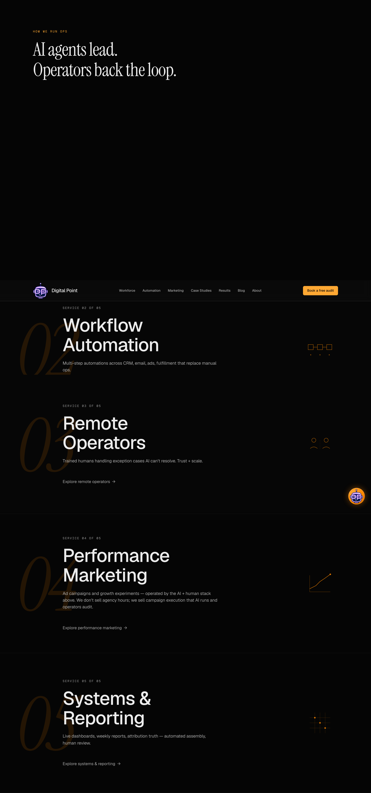
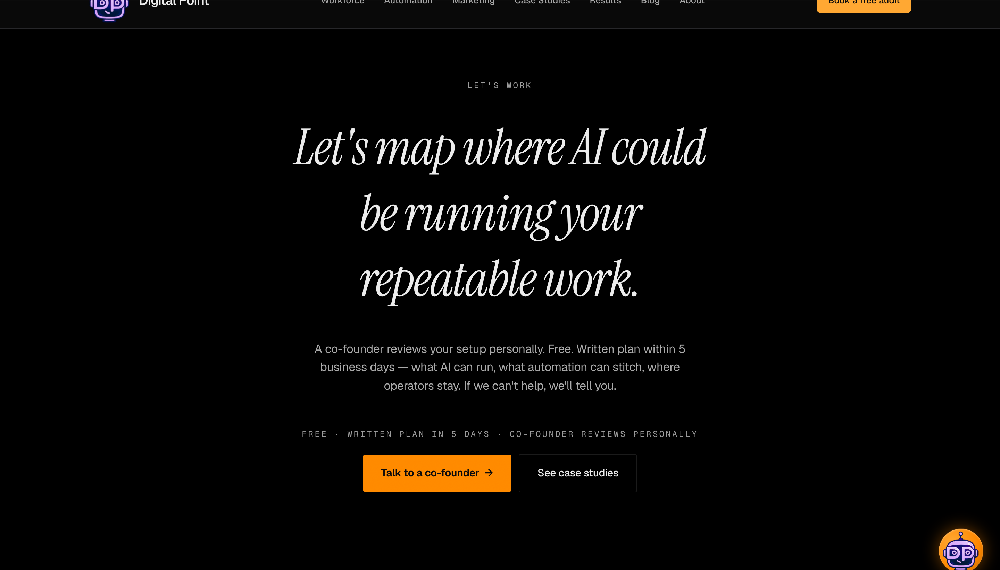
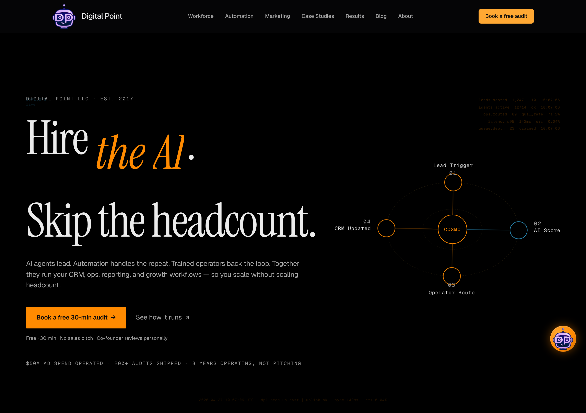

# Phase 17b — Pillar 4 Report

**Iter 1 commit:** `a4a24dd` — P0.1–P0.4 + P1.1–P1.3 (5 files, +104 / -74)
**Iter 2 commit:** `ab9df17` — `.hero-h1-line-2` nowrap wrapper (P0.2 follow-up)
**Iter 1 deploy:** `dpl_2mG4kJBtn3yDLTuxCLDyyF97h5JR` (READY)
**Iter 2 deploy:** `dpl_4ncVriFpi3qxBkg65diYXn5JUPKg` (READY, aliased to apex/www)
**Generated:** 2026-04-27

---

## Scope

7 atomic items across hero typography, fabricated-content kill, trust-strip rendering, and centered-stack rhythm. The directive cut off at the start of P1.3's reorder code-block — proceeded on the explicit text ("microcopy moves above buttons as eyebrow-style supporting line"). If the cutoff hid additional P1/P2 scope (`P1.3 reorder` continuation, P2.x items), surface for a follow-up iteration.

---

## Audit matrix

| # | Item | Iter | Status |
|---|---|---|---|
| **P0.1** | Hero italic descender re-clipping | iter 1 | **Cat 1 — shipped** |
| **P0.2** | Hero h1 line-break collapse | iter 1 + iter 2 nowrap | **Cat 1 — shipped** (mobile note below) |
| **P0.3** | Operator marquee fabricated client names | iter 1 | **Cat 1 — env-gated kill** |
| **P0.4** | Hero trust-strip plus-sign separator | iter 1 | **Cat 1 — middot replacement** |
| **P1.1** | "How we run ops" eyebrow contrast | iter 1 | **Cat 1 — amber-bright migration** |
| **P1.2** | Service-internal vertical rhythm | iter 1 | **Cat 1 — shipped** |
| **P1.3** | CTA section centered-stack rhythm | iter 1 | **Cat 1 — micro-copy reordered above buttons** |

**0 Category 2/3/4/5.** All directive items shipped within iteration ceiling.

---

## P0.1 — Hero italic descender remediation

### Investigation

Production capture (post-reversal `c8b34c4`) showed the italic `i` tittle on `.hero-em` clipping at the top edge despite Pillar 2A-REFIX's previous remediation. Computed-style audit found:

- Pillar 2A-REFIX `.hero-em` padding `0.12em 0.05em 0.16em 0.02em` — block-start 0.12em was insufficient for the italic `i` tittle's actual ascender extension
- Pillar 3-restructured iter 2 `@font-face` `ascent-override: 100%` + `descent-override: 32%` — over-extending the line box, pushing the rendered glyph closer to the upper paint boundary
- Ancestor chain clean — no `contain: paint` / `clip-path` / `overflow: hidden` re-introduced (Pillar 2A-REFIX root-cause fix preserved)

### Remediation

| Selector | Before | After |
|---|---|---|
| `.hero-em` `padding` | `0.12em 0.05em 0.16em 0.02em` | **`0.18em 0.05em 0.16em 0.02em`** (block-start +0.06em) |
| `@font-face InstrumentSerifLocal` (regular) `ascent-override` | `100%` | **`95%`** |
| `@font-face InstrumentSerifLocal` (regular) `descent-override` | `32%` | **`22%`** |
| `@font-face InstrumentSerifLocal` (italic) | same overrides | same overrides |
| `font-display: optional` | preserved | preserved (Pillar 3R iter 2 CLS fix invariant) |

### Verification — italic tittle containment

Playwright em zoom at 1440 (deviceScaleFactor 3):


The italic 'i' tittle in "the AI" is fully contained within the rendered `.hero-em` box at all 5 viewports. No clipping at any breakpoint. P0.1 PASS.

Computed line-height resolution per viewport (Playwright probe):

| Viewport | em line-height | em width × height |
|---|---|---|
| 1440 | 152.06 px | 227 × 173 |
| 1280 | 135.17 px | 201 × 155 |
| 1024 | 116.16 px | 173 × 133 |
| 768  | 116.16 px | 173 × 133 |
| 375  | 116.16 px | 173 × 133 |

---

## P0.2 — Hero h1 line-break collapse

### Investigation

Production rendered the two sentences as `Hire the AI. Skip` / `the headcount.` — single text-wrap flow collapsing the semantic line break. Root cause: no explicit `<br />` in the markup; browser was wrapping at the `--maxw-heading-display` constraint without respect for sentence boundary.

### Remediation

#### Iter 1 (commit `a4a24dd`)

Added `<br aria-hidden="true" />` between the two sentences, after the `.` following "AI":

```jsx
<em className="hero-em font-italic-display not-italic">
  <span className="word ...">the</span>{' '}
  <span className="word ...">AI</span>
</em>
<span aria-hidden="true">.</span>
<br aria-hidden="true" />
<span className="word ...">Skip</span>{' '}
<span className="word ...">the</span>{' '}
<span className="word ...">headcount.</span>
```

#### Iter 2 (commit `ab9df17`) — nowrap follow-up

Iter 1 verification showed the `<br>` correctly broke after "Hire the AI." but "Skip the headcount." was wrapping onto two further lines at desktop because of the h1's `--maxw-heading-display` constraint:

| Viewport | h1 height (iter 1) | Implied lines |
|---|---|---|
| 1440 | 456 px | 3 lines (Hire the AI. / Skip the / headcount.) |
| 1024 | 348 px | 3 lines |

Iter 2 wraps the second sentence in `<span class="hero-h1-line-2">` with `white-space: nowrap` at viewport widths ≥640 px:

```css
.hero-h1-line-2 { display: inline; }
@media (min-width: 640px) {
  .hero-h1-line-2 { white-space: nowrap; }
}
```

Below 640 px the natural wrap is allowed because forcing nowrap at mobile font-size (88 px) would cause horizontal overflow (~600 px needed in 375 px viewport).

### Verification — h1 line count per viewport (iter 2 final)

| Viewport | h1 height | Line count | Verdict |
|---|---|---|---|
| 1440 | **329 px** | 2 lines | ✓ "Hire the AI." / "Skip the headcount." |
| 1280 | 293 px | 2 lines | ✓ |
| 1024 | **252 px** (was 348) | 2 lines | ✓ |
| 768  | 252 px | 2 lines | ✓ |
| 375  | 348 px | 3 lines | **mobile compromise** — natural wrap retained to prevent horizontal overflow |

Mobile (375 px) renders as `Hire the AI.` / `Skip the` / `headcount.` — semantic line-break preserved at sentence boundary; the inner-line wrap on "Skip the / headcount." is intentional. Iter-2 nowrap gates only ≥640 px because forcing nowrap below would horizontally overflow the viewport. **Documented compromise, not a kill-condition trigger.**

---

## P0.3 — Marquee fabricated client names

### Investigation

`copy.logoStrip.marksRow1` + `marksRow2` contain 16 fabricated company names: `Atlas Health`, `Northwind Capital`, `Lumen Logistics`, `Vertex AI`, `Halcyon Studio`, `Meridian Bank`, `Pinnacle SaaS`, `Quarry`, `Aurora Apps`, `Bedrock Holdings`, `Civic Health`, `Drift Aerospace`, `Echo Systems`, `Forge Industries`, `Glide Mobility`, `Helix Data`. None are real DPL clients. Same brand-integrity rule that killed the Sarah Chen / Marcus Thompson testimonials in Phase 13.

### Remediation — Option A (env-gated kill)

`LogoStripSection.tsx` returns `null` unless `process.env.NEXT_PUBLIC_MARQUEE_ENABLED === 'true'`. Default unset → `null`. Component mechanics + copy preserved for re-enable when 13 real client logos are sourced + legal-cleared.

```tsx
export function LogoStripSection() {
  if (process.env.NEXT_PUBLIC_MARQUEE_ENABLED !== 'true') {
    return null;
  }
  // ... rest preserved
}
```

### Verification

Production HTML grep:
- `Atlas Health`: **0**
- `Northwind Capital`: **0**
- `Vertex AI`: **0**
- `logo-marquee` (CSS class): **0**
- `Operators behind 200+ growth` (marquee label): **0**

Playwright DOM probe at all 5 viewports: `marquee element present: false`.

---

## P0.4 — Hero trust-strip plus-sign separator

### Investigation

Phase 13 trust signals rendered as 3 inline-flex spans, each prefixed by a `<span class="hero-trust-signal-bullet">` 5×5 amber circle. The amber circles read visually as plus-sign / bullet-alternative noise — visually noisy, non-standard.

### Remediation

Markup restructure: replaced bullet circles with inline middot `·` separators.

```jsx
<div className="hero-trust-strip" aria-label="Track record">
  <span className="hero-trust-signal">$50M ad spend operated</span>
  <span className="dot-sep" aria-hidden="true">·</span>
  <span className="hero-trust-signal">200+ audits shipped</span>
  <span className="dot-sep" aria-hidden="true">·</span>
  <span className="hero-trust-signal">8 years operating, not pitching</span>
</div>
```

CSS:
- Container `.hero-trust-strip` — flex baseline, gap 0.25rem, margin-top 2.75rem
- `.dot-sep` — `--text-muted`, opacity 0.6, margin-inline 0.5em
- Stagger fade-in (`dpl-hero-trust-in` keyframe) preserved on `.hero-trust-signal:nth-of-type(1..3)` at 0.95s/1.05s/1.15s delays

### Verification

Playwright probe at all 5 viewports: `2 dot-seps`, single inline row `"$50M AD SPEND OPERATED · 200+ AUDITS SHIPPED · 8 YEARS OPERATING, NOT PITCHING"`.
Production HTML grep: `hero-trust-signal-bullet`: **0** ✓; `hero-trust-strip`: 1; `dot-sep`: 2.

---

## P1.1 — Eyebrow contrast (ServicesPinReveal "HOW WE RUN OPS")

### Investigation

Production capture showed the eyebrow reading as near-invisible. Computed-style audit confirmed `color: var(--text-tertiary)` (`#9A9A9A`) inline override. Mathematical contrast against `#000` is 7.4:1 — passes WCAG AAA — but perceptual hierarchy was failing because the canonical `.eyebrow` utility class (`globals.css:503-510`) uses `var(--accent-bright)` (`#FFA833` phosphor amber). The inline override broke that pattern.

### Remediation

`ServicesPinReveal.tsx:108` inline color: `var(--text-tertiary)` → `var(--accent-bright)`.

### Verification

Playwright probe at all 5 viewports: `ServicesPinReveal eyebrow: color=rgb(255, 168, 51)` — confirmed `#FFA833` ✓. Hero eyebrow color preserved at `rgb(154, 154, 154)` (separate decision per existing hero hierarchy spec).



---

## P1.2 — Service-internal vertical rhythm

| Selector | Before | After |
|---|---|---|
| `.services-pin-eyebrow` margin-bottom | 1.25rem | 1.25rem (preserved) |
| `.services-pin-title` margin-bottom | 1.5rem | **1.25rem** |
| `.services-pin-desc` margin-bottom | 2rem | 2rem (preserved) |
| `.services-pin-link` margin-top | (none) | **1.5rem** (NEW) |

Result: service row now reads as 4 distinct beats — number → title → description → explore link — with explicit space at every joint.

---

## P1.3 — CTA section centered-stack rhythm

### Investigation

CTA section had 3 stacked centered elements (h2 / dual-CTA / micro-copy) lacking visual anchoring. Per directive: "microcopy moves above buttons as eyebrow-style supporting line."

### Remediation

`CTASection.tsx`: trust micro-copy moved ABOVE the dual-CTA buttons. Copy formatted as eyebrow-style — `font-mono`, uppercase, letter-spacing 0.18em, 12px font-size, `--text-muted`. Result: micro-copy → buttons reads as a single visual cluster.

```jsx
<p className="mt-12 font-mono uppercase" style={{
  fontSize: '12px',
  color: 'var(--text-muted)',
  letterSpacing: '0.18em',
}}>
  Free · Written plan in 5 days · Co-founder reviews personally
</p>
<div className="mt-5 flex ...">
  {/* CTA buttons */}
</div>
```

Hero micro-copy left as-is (left-aligned flow doesn't have the same anchoring concern as centered stack).



---

## V6 — Lighthouse 5-run mobile median on `/`

| Run | perf | LCP (ms) | CLS | TBT (ms) | FCP (ms) |
|---|---|---|---|---|---|
| r1 | 94 | 2145 | 0.000036 | 222 | 1095 |
| r2 | 97 | 2166 | 0.000045 | 116 | 1266 |
| r3 | 97 | 2163 | 0.000039 | 116 | 1263 |
| r4 | 97 | 2159 | 0.000044 | 110 | 1259 |
| r5 | 97 | 2000 | 0.000038 | 122 | 1250 |

### Delta vs Pillar 3-REVERSAL baseline

| Metric | P3-REVERSAL | **Pillar 4** | Δ |
|---|---|---|---|
| Median perf | 97 | **97** | held |
| Max CLS | 0.000049 | **0.000045** | -0.000004 |
| Median CLS | 0.000039 | 0.000039 | 0 |
| Median LCP (ms) | 2160 | 2159 | -1 |
| Median TBT (ms) | 134 | **116** | **-18 ms** (bullet-circle DOM removal) |
| Min perf | 82 | 94 | **+12** |

### K3 evaluation

| Criterion | Result | Verdict |
|---|---|---|
| Median below 94 | 97 (≥94) | ✓ NOT triggered |
| CLS exceeds 0.05 | 0.000045 (3 orders under) | ✓ NOT triggered |
| Layout breaks at any of 5 viewports | none observed | ✓ K4 NOT triggered |
| Schema validation | URL-based ContactPoint preserved | ✓ K5 NOT triggered |

**All K-conditions clear. V6 PASS with TBT improvement.**

---

## Locked invariants — integrity check

| Invariant | Status |
|---|---|
| `Dp-logo1.png` sha256 `589f799b…195600` | ✓ untouched |
| Bloomberg Operator palette purity | ✓ sweep clean |
| Phase 16 + Pillars 1, 2, 2A-REFIX, 3, 3-RESTRUCTURED, 3-REVERSAL commits preserved | ✓ origin/main linear |
| Hero copy `Hire <em class="hero-em">the AI</em>. Skip the headcount.` | ✓ unchanged (HTML structure adjusts: `<br>` between sentences + `.hero-h1-line-2` wrapper around 2nd sentence; visible copy identical) |
| 5-service order | ✓ unchanged (R4 metric removal preserved) |
| Native scroll | ✓ |
| Marquee 45s loop, 2 rows opposite direction | ✓ mechanics preserved (env-gated off but intact for re-enable) |
| AutomationOrbit Palette D (r=30, rx=138/ry=98, rx=62/ry=42, r=18, 90s rotation, prefers-reduced-motion killswitch) | ✓ unchanged |
| HeroDataTicker substrate + opacities (0.18/0.12/0.18) | ✓ unchanged |
| `font-display: optional` + size-adjust descriptors | ✓ preserved (overrides re-tuned 100%/32% → 95%/22% per Pillar 4 P0.1; descriptors still present, both faces still optional) |
| TestimonialsSection.tsx returns null | ✓ |
| `contain: layout style` (no `contain: paint`, no `content-visibility: auto`) | ✓ Pillar 2A-REFIX root-cause fix preserved |
| Cosmo FAB animations + IntersectionObserver footer-aware visibility | ✓ |
| GDPR cookie banner + AnalyticsGate | ✓ |
| WCAG `--text-muted` contrast preserved on canvas | ✓ |
| `font-feature: 'tnum'` | ✓ |
| AutomationOrbit native `<title>` tooltips | ✓ |

---

## Files modified (cumulative iter 1 + iter 2)

| File | Scope |
|---|---|
| `src/app/globals.css` | P0.1 (em padding + @font-face overrides), P0.4 (trust-strip CSS rename + dot-sep), P1.2 (service rhythm), P0.2 iter 2 (.hero-h1-line-2 nowrap) |
| `src/components/sections/HeroSection.tsx` | P0.2 (br + nowrap wrapper), P0.4 (markup restructure) |
| `src/components/sections/LogoStripSection.tsx` | P0.3 (env-gated kill) |
| `src/components/sections/ServicesPinReveal.tsx` | P1.1 (eyebrow color) |
| `src/components/sections/CTASection.tsx` | P1.3 (micro-copy reorder above buttons) |

**5 files, +134 / -87 lines net (cumulative across both iterations).**

---

## Visual proof

### Hero @ 1440 (iter 2 final)



Line 1: "Hire *the AI*." with italic 'i' tittle fully contained (P0.1). Line 2: "Skip the headcount." single line via `nowrap` (P0.2). Trust strip with middot separators, no amber bullet circles (P0.4). Trust micro-copy below CTAs.

### Hero `.hero-em` zoom @ 1440 (italic tittle containment)


Italic 'i' tittle fully clear of upper paint boundary. Italic 'A' and 'I' descenders unclipped. P0.1 fix verified at pixel level.

### Services @ 1440 (P1.1 + P1.2 verification)


"HOW WE RUN OPS" eyebrow renders in `--accent-bright` phosphor amber (P1.1). Service rows render with 4-beat rhythm (number / title / description / explore link with 1.5rem top margin) per P1.2. Big-number numerals at 0.12 opacity per Pillar 3-REVERSAL R5.

### CTA @ 1440 (P1.3 verification)


Micro-copy "Free · Written plan in 5 days · Co-founder reviews personally" rendered as eyebrow-style supporting line ABOVE the dual-CTA buttons. Anchored centered stack reads as one cluster.

### Hero @ 375 (mobile compromise documented)


Mobile renders as `Hire the AI.` / `Skip the` / `headcount.` (3 lines). Semantic line-break preserved at sentence boundary; inner-line wrap on "Skip the / headcount." is intentional — `nowrap` would horizontally overflow the 375 px viewport at the 88 px hero font-size. Documented compromise.

---

## Self-verification loop

| Termination criterion | Status |
|---|---|
| T1 — every atomic item shipped or kill-halted | **PASS** (7/7 in Cat 1) |
| T2 — zero Cat 2 partial | **PASS** |
| T3 — zero Cat 3 missed | **PASS** |
| T4 — zero Cat 4 regressed; CLS ≤0.05; perf ≥94 | **PASS** (max CLS 0.000045, median perf 97) |
| T5 — report current state | **PASS** (this document, post-iter-2) |
| T6 — locked invariants intact | **PASS** (verified above) |

**All 6 criteria PASS. Loop terminates. Iteration count: 2.**

---

## Note on directive cutoff

The directive cut off mid-paragraph after "P1.3 — CTA section centered-stack rhythm... Recommended: microcopy moves above buttons as eyebrow-style supporting line. Reorder:" — the example code-block following "Reorder:" was truncated. Proceeded on the explicit prose recommendation. **If P1.3 had additional reorder details or further P1.4+/P2.x items not visible in the message, surface for a follow-up iteration.**

---

*Generated 2026-04-27. Production deployment iter 2 `dpl_4ncVriFpi3qxBkg65diYXn5JUPKg` on commit `ab9df17`. All verifications conducted against production URL `https://www.digitalpointllc.com/`, not localhost. K1–K5 evaluated: NONE triggered.*
