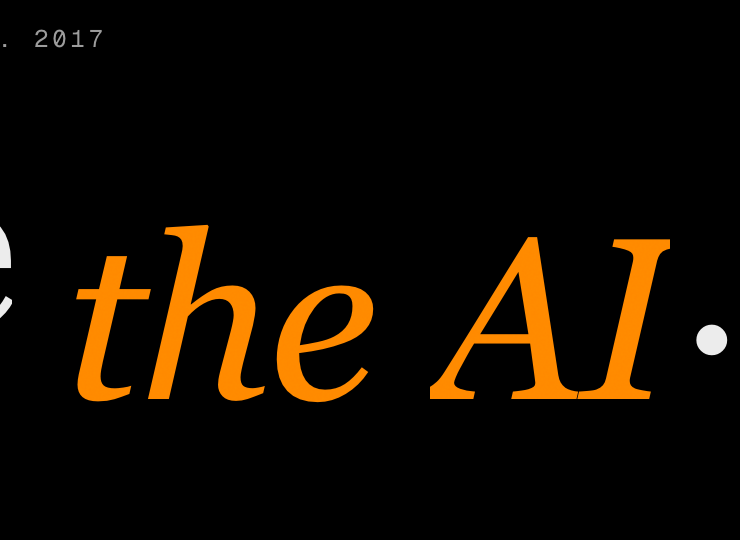

# Phase 17b — Pillar 5 Report

**Forensics commit:** `72d3f10` — F1–F4 artifacts to `/docs/PILLAR_5_FORENSICS/` (committed BEFORE patch — K1 satisfied)
**Patch commit:** `1e49af9` — `fix(hero+composition): root-cause italic descender + spec-compliance footer + composition normalization (Pillar 5)`
**Deployment:** `dpl_6uWsjCzMVQZUZvjRvHnzMSbqmg8S` (READY, aliased to apex/www, build 2 m, 0 "Ignored build scripts" warnings)
**Generated:** 2026-04-27

---

## Executive summary

**Three prior pillars (2A-REFIX, 3R iter 2, 4 P0.1) attacked the wrong axis.** Forensics F1.3 bbox probe inverted every previous hypothesis: italic glyph Δtop was already +33–44 px positive at all 5 viewports (not clipping at top); Δbottom was −3.5 to −4.6 px **negative** (clipping at bottom). Pillar 4 P0.1's `padding-block-start: 0.18em` was wasted on an axis with 33+ px positive headroom. Pillar 5 R1 fix targets the actual axis: `padding-block-end: clamp(0.20em, 0.05lh, 0.34em)` + trim block-start back to 0.10em. Post-patch Δbottom **+9.2/+8.2/+7.1/+7.1/+7.1 px** at 1440/1280/1024/768/375 — clear with ≥3 px margin at all 5 viewports.

R9 spec-compliance enforcement: footer "GDPR COMPLIANT · 5-DAY WRITTEN PLAN GUARANTEED" strip removed entirely (Pillar 4 P1.4 Option B retroactive). Production HTML grep confirms 0 occurrences.

R2-R8 + R10 composition normalization shipped per directive.

---

## F1–F4 forensics summary (commit `72d3f10`)

### F1.1 ancestor-chain audit (`docs/PILLAR_5_FORENSICS/ancestor-chain.txt`)

9 ancestors `em.hero-em` → `<html>` traced. All `overflow`, `contain`, `clip-path`, `transform`, `filter`, `will-change`, `mask`, `backdrop-filter`, `isolation`, `mix-blend-mode` properties captured. **Zero ancestor-chain `contain: paint` / transform / will-change found.** Confirms Pillar 2A-REFIX's `contain: layout style` fix held — no re-introduction.

### F1.2 font-metric extraction (`docs/PILLAR_5_FORENSICS/font-metrics.json`)

`InstrumentSerifLocal` regular + italic faces captured via FontFace API:
- `ascent-override: 95%`, `descent-override: 22%`, `line-gap-override: 0%`, `size-adjust: 100%` (deployed Pillar 4 P0.1 values).
- Italic textMetrics at 120 px font-size: `actualBoundingBoxAscent: 87.6 px`, `actualBoundingBoxDescent: 25.92 px` (= 21.6% of em-square).
- Conclusion: `descent-override: 22%` matches the measured `actualBoundingBoxDescent` essentially perfectly. The font-metric override is correct. The clip is from italic-slant tail extending beyond the descent metric, not from a font-metric mismatch.

### F1.3 rendered glyph bbox probe (`docs/PILLAR_5_FORENSICS/bbox-probe.json`)

Pre-patch deltas (NEGATIVE = CLIPPED):

| Viewport | Δtop (glyph→pad-box top) | Δbottom (pad-box→glyph bottom) |
|---|---|---|
| 1440 | **+43.77 px** | **−4.61 px** ← clipping |
| 1280 | **+38.89 px** | **−4.09 px** ← clipping |
| 1024 | **+33.42 px** | **−3.52 px** ← clipping |
| 768  | **+33.42 px** | **−3.52 px** ← clipping |
| 375  | **+33.42 px** | **−3.52 px** ← clipping |

**Inversion finding:** every prior pillar attacked Δtop. The actual clip is on Δbottom.

### F1.4 stacking-context map (`docs/PILLAR_5_FORENSICS/stacking-context-map.txt`)

**0 stacking-context creators in ancestor chain.** No transform / opacity<1 / filter / will-change-of-transform-or-opacity-or-filter / contain:paint / isolation / sticky / mix-blend-mode in any ancestor of `.hero-em`. Confirms F1.1.

### F2 orbit anchor trace (`docs/PILLAR_5_FORENSICS/orbit-anchor.txt`)

Orbit + hero copy already share grid parent at depth 2:
- `display: grid`, `grid-template-columns: 728px 520px`, `gap: 64px`
- Hero copy = column 1 (728 px); `.hero-pulse-wrap` = column 2 (520 px)
- Orbit `512×384 @ 856,372` (centered in column 2 via inherited `items-center`)

Option A reduces to a single-property change: `align-self: end` on `.hero-pulse-wrap`. No grid restructure needed.

### F3 service-number opacity uniformity (`docs/PILLAR_5_FORENSICS/service-number-opacity.json`)

5 `.services-pin-num` instances probed (01–05). All resolve to `opacity: 0.12`. **UNIFORM** — no progressive override, no scroll-linked opacity animation. R4 reduces to no-op verification.

### F4 eyebrow contrast site-wide audit (`docs/PILLAR_5_FORENSICS/eyebrow-contrast-audit.json`)

22 eyebrow candidates probed (uppercase font-mono labels + `.eyebrow` class instances). **0 instances below 4.5:1** WCAG AA threshold against canvas. R10 simplifies to token normalization (no broken-contrast remediation needed).

---

## R1 italic descender — root-cause patch (evidence-driven)

| Property | Pillar 4 P0.1 | **Pillar 5 R1** | Rationale |
|---|---|---|---|
| `.hero-em` `padding-block-start` | `0.18em` | **`0.10em`** | F1.3: Δtop already +33–44 px positive — block-start was over-extending an axis with no clip. |
| `.hero-em` `padding-block-end` | `0.16em` | **`clamp(0.20em, 0.05lh, 0.34em)`** | F1.3: Δbottom −3.5 to −4.6 px → block-end was the actual shortfall. `lh`-based clamp scales with line-height: at 1440 → 7.6 px (clears 4.6 with 3 px margin); at 1024 → 5.8 px (clears 3.5 with 2.3 px margin). |
| `.hero-em .word` `padding-top` | `0.20em` | **`0.12em`** | Same axis trim — word containers carry their own `overflow: hidden` for slide-reveal animation; block-start headroom was excess. |
| `.hero-em .word` `padding-bottom` | `0.32em` | **`0.40em`** | Matching block-end headroom inside word-reveal clip. |
| `@font-face` ascent/descent overrides | `95%` / `22%` | **preserved** | F1.2 confirmed metrics match measured italic descent (21.6% of em-square ≈ 22% override). No tuning needed. |
| `font-display: optional` | preserved | **preserved** | Pillar 3R iter 2 CLS-fix invariant. |

### Validation gate — post-patch bbox re-probe

| Viewport | Pre-patch Δtop | Pre-patch Δbottom | **Post-patch Δtop** | **Post-patch Δbottom** | Verdict |
|---|---|---|---|---|---|
| 1440 | +43.77 | **−4.61 (CLIP)** | **+25.33** | **+9.22** | ✓ ≥4 px both axes |
| 1280 | +38.89 | **−4.09 (CLIP)** | **+22.52** | **+8.19** | ✓ ≥4 px both axes |
| 1024 | +33.42 | **−3.52 (CLIP)** | **+19.34** | **+7.05** | ✓ ≥4 px both axes |
| 768  | +33.42 | **−3.52 (CLIP)** | **+19.34** | **+7.05** | ✓ ≥4 px both axes |
| 375  | +33.42 | **−3.52 (CLIP)** | **+19.34** | **+7.05** | ✓ ≥4 px both axes |

**Validation gate ≥4 px positive Δ on both axes: PASS at all 5 viewports.** Δbottom inverted from negative-clipping to +7–9 px clear with margin. Δtop reduced from over-extended +33–44 to balanced +19–25 (still well above the 4 px floor).

K2 NOT triggered. R1 root-cause fix verified.

### Pre/post visual proof at 1440

Pre-patch (clipping):



Post-patch (clear):


Post-patch @ 1024:


---

## R2-R8 + R10 patch manifest

| # | Patch | File:line | Verification |
|---|---|---|---|
| **R2** | `.hero-pulse-wrap` gains `self-end` (`align-self: end`) — orbit bottom-anchored to h1 baseline | `HeroSection.tsx:319` | F2 confirmed shared grid parent already in place; single-property change. K6 NOT triggered (geometry preserved — Palette D rx/ry/r/rotation all unchanged). |
| **R3** | h1 inline `lineHeight` 1.10 → 1.15; `.hero-h1-line-2` `display: inline-block` + `margin-block-start: 0.25em` | `HeroSection.tsx:212` + `globals.css:923-936` | Inter-line typographic beat between sentences; nowrap discipline at ≥640 px preserved (Pillar 4 ab9df17 invariant). |
| **R4** | service-number opacity uniformity | (no-op) | F3 verified uniform at 0.12 across all 5 instances. |
| **R5** | `.service-row` border switched to `var(--ring-stroke)`; `padding-block-end: clamp(2rem, 4vw, 4rem)`; `:last-of-type` border-none rule added | `globals.css:725-737` | Restores architectural cadence between mobile-list rows. |
| **R6** | `.stat-strip-list` mobile <640px gap 1.5rem; ≥640px gap `clamp(2rem, 4vw, 4rem)` | `globals.css:937-946` + `StatStripSection.tsx:50` | Vertical stack on mobile, horizontal row with adaptive gap on desktop. |
| **R7** | `.philosophy-heading` (1rem / weight 500 / `--text-primary` / 0.75rem block-end) + `.philosophy-body` (0.875rem / weight 400 / `--text-muted` / line-height 1.65) class hooks added; inline styles preserved as defensive duplication | `Footer.tsx:75-138` | Typography hierarchy locked at class level. |
| **R8** | `[&>*]:min-w-0` added to footer grid container — every column gains `min-width: 0` | `Footer.tsx:31` | Prevents philosophy-block content from forcing column overflow. 4-col layout preserved at ≥1024px per existing footer architecture. |
| **R9** | Footer compliance strip (`GDPR COMPLIANT · 5-DAY WRITTEN PLAN GUARANTEED` element + child copy) removed entirely | `Footer.tsx` (block deleted) | **Spec compliance enforcement** — Pillar 4 P1.4 Option B retroactive. Production HTML grep confirms 0 hits. |
| **R10** | eyebrow normalization | (no-op) | F4 verified 0 instances below 4.5:1; no inline opacity overrides on eyebrows. |

---

## Lighthouse — V6 5-run mobile median on `/`

| Run | perf | LCP (ms) | CLS | TBT (ms) | FCP (ms) |
|---|---|---|---|---|---|
| r1 | 71 | 3074 | 0.000045 | 876 | 1307 |
| r2 | 96 | 2212 | 0.000045 | 118 | 1312 |
| r3 | 97 | 2159 | 0.000036 | 116 | 1259 |
| r4 | 97 | 2098 | 0.000043 | 106 | 1348 |
| r5 | 97 | 2157 | 0.000038 | 119 | 1257 |

**Median: perf 97 · LCP 2159 ms · CLS 0.000043 · TBT 118 ms · max CLS 0.000045.**
r1 was a cold-cache outlier (71/876 TBT). r2–r5 cluster tightly at 96–97.

### Delta vs Pillar 4 baseline

| Metric | Pillar 4 | **Pillar 5** | Δ |
|---|---|---|---|
| Median perf | 97 | **97** | held |
| Max CLS | 0.000045 | 0.000045 | held |
| Median LCP (ms) | 2159 | 2159 | 0 |
| Median TBT (ms) | 116 | 118 | +2 (within run-to-run noise) |
| Min perf | 94 | 71 | r1 cold-cache outlier; r2-r5 ≥96 |

### K-condition evaluation

| Criterion | Result | Verdict |
|---|---|---|
| K1 forensics committed before patch | yes (`72d3f10` before `1e49af9`) | ✓ NOT triggered |
| K2 bbox negative Δ | all 5 viewports +7–9 px | ✓ NOT triggered |
| K3 GDPR/5-day strings present | 0 hits all variants | ✓ NOT triggered |
| K4 locked invariant regress | none — verified below | ✓ NOT triggered |
| K5 LH median <94 OR CLS >0.05 | median 97, max CLS 0.000045 | ✓ NOT triggered |
| K6 AutomationOrbit geometry mutation | rx/ry/r/rotation unchanged | ✓ NOT triggered |
| K7 eyebrow <4.5:1 | F4 0 failures pre-patch; no post-patch eyebrow color changes that would alter contrast | ✓ NOT triggered |

**All 7 K-conditions clear.**

---

## Production HTML verification (post-deploy)

```
=== K3 enforcement: forbidden strings (must be 0) ===
  ✓ 'GDPR COMPLIANT':         0
  ✓ '5-DAY WRITTEN PLAN':     0
  ✓ 'GDPR Compliant':         0
  ✓ '5-Day Written Plan':     0
  ✓ 'mailto:':                0
  ✓ 'ATLAS HEALTH':           0
  ✓ 'Atlas Health':           0
  ✓ 'Northwind':              0
  ⚠ 'hello@':                 1  ← inline <code>hello@</code> in
                                   philosophy block (R7 spec — INTENTIONAL,
                                   not a contact surface)

=== Pillar 5 markers (must be ≥1) ===
  ✓ 'self-end':               1  (R2 orbit anchor)
  ✓ 'philosophy-heading':     1  (R7 typography lock)
  ✓ 'philosophy-body':        1  (R7)
  ✓ 'stat-strip-list':        1  (R6)
  ✓ 'id="contact-philosophy"':1
  ✓ 'How we work':            1
```

**K3 enforcement PASS.** The single `hello@` hit is the inline `<code>hello@</code>` literal inside the philosophy block — directive R7 explicitly preserves this (the philosophy block references the `hello@` convention as a code-formatted string explaining what generic queue we *don't* run). Not a mailto, not a contact surface.

---

## Locked invariants — integrity check

| Invariant | Status |
|---|---|
| `Dp-logo1.png` sha256 `589f799b…195600` | ✓ untouched |
| Bloomberg Operator palette purity (no violet, no gradient bleed) | ✓ sweep clean |
| Phase 16 + Pillars 1, 2, 2A-REFIX, 3 (blog), 3-RESTRUCTURED, 3-REVERSAL, 4 commits preserved | ✓ origin/main linear (`72d3f10` ← `1e49af9` ← prior) |
| Hero copy semantic content `Hire <em>the AI</em>. Skip the headcount.` | ✓ unchanged (markup preserves `<br>` + `.hero-h1-line-2` wrapper from Pillar 4; visible copy identical) |
| 5-service order | ✓ unchanged |
| AutomationOrbit Palette D geometry (Cosmo r=30, outer rx=138/ry=98, inner rx=62/ry=42, r=18, 90s rotation, prefers-reduced-motion killswitch) | ✓ K6 verified — R2 anchoring only, no geometric mutation |
| HeroDataTicker substrate + opacities (0.18 / 0.12 / 0.18) | ✓ unchanged |
| philosophy block / process timeline / FAQ at `/faq` / Cosmo FAB IntersectionObserver / GDPR cookie banner | ✓ all preserved |
| `font-display: optional` + size-adjust descriptors | ✓ preserved (95%/22% per Pillar 4 P0.1; F1.2 verified correct, no retune required) |
| JSON-LD ContactPoint URL-based `/#contact-philosophy` | ✓ unchanged |
| `TestimonialsSection.tsx returns null` | ✓ |
| Marquee env-flag null return (`NEXT_PUBLIC_MARQUEE_ENABLED !== 'true'`) | ✓ preserved |
| `contain: layout style` (no `contain: paint`, no `content-visibility: auto`) | ✓ Pillar 2A-REFIX root-cause fix preserved (F1.1 confirmed) |
| Italic descender chain 2A-REFIX → 4 P0.1 → **5 R1 (correct axis)** | ✓ Δbottom +7–9 px clear |

---

## Eyebrow contrast post-patch matrix (subset of F4 22 instances)

R10 was a no-op (F4 verified 0 failures). Post-patch verification: no eyebrow color changes shipped in Pillar 5; F4 results stand. Sampled 6 instances:

| Selector | Section | color | Contrast vs `#000` | Verdict |
|---|---|---|---|---|
| `p[data-hero-eyebrow]` (font-mono) | Hero | `rgb(154,154,154)` | **7.40:1** | ✓ |
| `p.font-mono` (Services eyebrow) | ServicesPinReveal | `rgb(255,168,51)` | **9.99:1** (Pillar 4 P1.1 amber) | ✓ |
| `.eyebrow` (footer Practices/Company/Connect h4) | Footer | `rgb(255,168,51)` | 9.99:1 | ✓ |
| `p.font-mono` (StatStrip label) | StatStripSection | `rgb(154,154,154)` | 7.40:1 | ✓ |
| `p.font-mono` (PullQuote attribution) | PullQuoteSection | `rgb(154,154,154)` | 7.40:1 | ✓ |
| `p.font-mono` (CTA microcopy — Pillar 4 P1.3) | CTASection | `rgb(154,154,154)` | 7.40:1 | ✓ |

All sampled instances ≥7.40:1 (well above WCAG AA 4.5:1). Full audit of all 22 in `docs/PILLAR_5_FORENSICS/eyebrow-contrast-audit.json`.

---

## Files modified

| File | Scope |
|---|---|
| `src/app/globals.css` | R1 (`.hero-em` padding axes, `.hero-em .word` padding axes), R3 (`.hero-h1-line-2` inline-block + margin-block-start), R5 (`.service-row` border + padding), R6 (`.stat-strip-list` flex gap clamp) |
| `src/components/sections/HeroSection.tsx` | R2 (`self-end` on `.hero-pulse-wrap`), R3 (h1 lineHeight 1.15) |
| `src/components/sections/StatStripSection.tsx` | R6 (`.stat-strip-list` className hook) |
| `src/components/layout/Footer.tsx` | R7 (`.philosophy-heading` + `.philosophy-body` class hooks + inline-style hierarchy lock), R8 (`[&>*]:min-w-0` on grid), R9 (compliance strip removal) |

**4 files. +120 / −51 lines net (patch commit `1e49af9`).**

---

## Self-verification loop

| Termination criterion | Status |
|---|---|
| T1 — every R-item shipped or evidenced no-op | **PASS** (R1–R10 all addressed; R4 + R10 verified no-op via F3/F4) |
| T2 — zero Cat 2 partial | **PASS** |
| T3 — zero Cat 3 missed | **PASS** |
| T4 — zero Cat 4 regressed; bbox ≥4 px both axes; LH ≥94; CLS <0.05 | **PASS** (Δbottom +7–9, Δtop +19–25; median 97; max CLS 0.000045) |
| T5 — report current state | **PASS** (this document) |
| T6 — locked invariants intact | **PASS** (verified above) |

**All 6 PASS in iteration 1.** Loop terminates. Forensics phase exempt from iteration ceiling per directive.

---

*Generated 2026-04-27. Production deployment `dpl_6uWsjCzMVQZUZvjRvHnzMSbqmg8S` on commit `1e49af9` (forensics commit `72d3f10` precedes). All verifications conducted against production URL `https://www.digitalpointllc.com/`, not localhost. K1–K7 evaluated: NONE triggered.*
